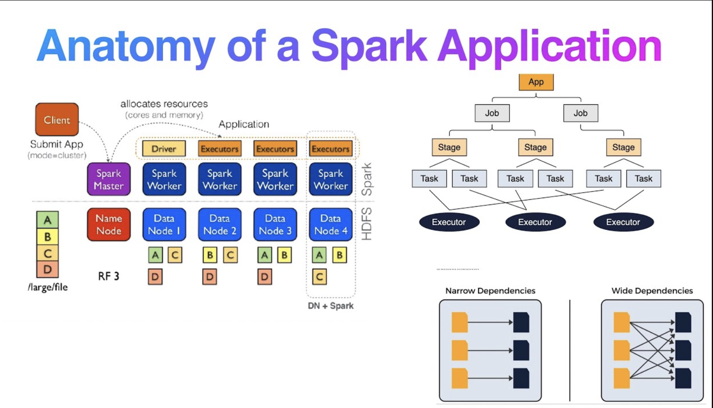

# Monday: Apache Spark Architecture, Execution, and Performance

> Status: Guided lecture notes
>
> Level: Beginner to intermediate
>
> Applies to: PySpark, `spark-submit`, YARN, and distributed batch processing
>
> Evidence: Technical claims were checked against Apache Spark 4.2.0 documentation; all 11 submitted videos and their available English caption tracks were reviewed; commands are illustrative, and no YARN submission, dependency-resolution run, or sizing benchmark was performed
>
> Last reviewed: 2026-09

## Overview

Apache Spark is a distributed processing engine. A Spark application coordinates work across multiple processes so that partitions of a large dataset can be processed in parallel.

This lesson focuses on six practical questions:

1. What happens when you submit a Spark application with `spark-submit`?
2. Why can a PySpark application still need JVM libraries packaged as JAR files?
3. How do Catalyst and Adaptive Query Execution turn DataFrame code into an executable plan?
4. How do partitions, shuffles, and skew affect task performance?
5. When should you repartition, persist, or broadcast data?
6. How do you choose an initial number of executors, executor cores, and executor memory?

Along the way, the lesson connects lazy transformations and actions to Spark's application, job, stage, task, partition, exchange, shuffle, and DAG terminology. The resource calculations produce a starting configuration, not a universally correct answer. Production behavior must be validated with the Spark UI, execution plans, application metrics, representative data, and the limits of the cluster or queue.

## Learning objectives

After completing this guide, you should be able to:

- Distinguish a Spark driver, executor, worker node, task, and partition.
- Explain how Java, Scala, Python, the JVM, and heap memory relate in a PySpark application.
- Choose between `--jars`, `--packages`, and `--py-files` for different dependency types.
- Explain why production Spark applications normally use `spark-submit` instead of running a file directly with `python`.
- Describe the difference between client and cluster deploy modes.
- Explain common `spark-submit` options and recognize cluster-manager-specific options.
- Distinguish logical plans from physical plans and explain the roles of Catalyst and Adaptive Query Execution.
- Trace an action through an application, job, stages, tasks, and task attempts.
- Distinguish narrow dependencies, wide dependencies, shuffles, and actions without relying only on method names.
- Explain why lazy evaluation waits for an action and how Catalyst can push eligible filters toward the data source.
- Distinguish persisted catalog statistics from AQE's current-query runtime statistics.
- Diagnose data skew and explain when AQE, repartitioning, or salting can help.
- Compare `coalesce()` with `repartition()` and choose between them from evidence.
- Explain the relationship among `cache()`, `persist()`, storage levels, and serialization.
- Distinguish a general broadcast variable from a broadcast join.
- Calculate a reasonable initial static executor configuration from available CPU and memory.
- Explain why workload measurements matter more than a memorized sizing formula.

## Prerequisites

- Basic Python command-line usage.
- Basic CPU, memory, process, and cluster concepts.
- The Spark and cluster-management sections in [Friday: Distributed Systems, Hadoop, HDFS, Hive, and Spark](../Week2/5_Fri_DS_HDFS.md).

---

## 1. Spark application mental model

One Spark application contains one **driver** and usually multiple **executors**. The cluster manager grants resources, but the Spark driver decides how the application's work is divided and scheduled.

```text
submission client
      |
      | application code + configuration
      v
cluster manager (for example, YARN or Kubernetes)
      |
      | launches processes and allocates resources
      v
driver ---------------------> executors
  |        tasks and code       |  |  |
  |                             v  v  v
  |                          partitions
  |
  +<---------------------- status and results
```

| Term | Meaning |
| --- | --- |
| Application | One coordinated Spark program consisting of a driver and its executors |
| Driver | The process that creates the Spark session, plans work, schedules tasks, and tracks the application |
| Executor | An application-specific process that runs tasks and stores shuffle or cached data in memory or on disk |
| Worker node | A machine, virtual machine, or container host that provides CPU and memory; one worker can host multiple executor processes |
| Partition | A logical chunk of a distributed dataset that can be processed independently during a stage |
| Task | The unit of work Spark sends to one executor for one partition in one stage |
| Cluster manager | The system that allocates cluster resources, such as YARN, Kubernetes, or Spark Standalone |

An executor is not another name for a worker. A worker supplies resources; an executor is a Spark process using some of those resources for one application.

## 2. Spark, the JVM, Scala, and PySpark

The **Java Virtual Machine**, or **JVM**, is a runtime that executes JVM bytecode and manages services such as memory allocation and garbage collection. Java and Scala are separate programming languages, but both normally compile to JVM bytecode and can use many of the same Java libraries. Scala has strong Java interoperability, but Java syntax cannot simply be pasted into any Scala program unchanged. Scala is common in the Spark ecosystem, while production Spark applications are also written through Python, Java, R, and SQL interfaces.

Apache Spark is largely implemented in Scala and runs its core engine in JVM processes. PySpark lets Python code control that engine. A PySpark application can therefore involve both Python processes and JVM processes:

```text
PySpark driver code
      |
      | sends DataFrame expressions and commands
      v
Spark driver JVM --------------------> executor JVMs
                                           |
                                           | starts Python workers when Python execution is required
                                           v
                                      Python worker processes
```

**Heap memory** is the JVM-managed memory used for objects. The Spark driver and each executor have their own JVM heap. Python worker memory is separate from the executor JVM heap, even though the cluster manager must still include it in the executor container's total memory budget.

| Memory area | Common contents | Important limit |
| --- | --- | --- |
| Driver JVM heap | Query plans, task metadata, broadcast metadata, and bounded results | The driver should not collect the complete distributed dataset |
| Executor JVM heap | Execution state, JVM objects, shuffle structures, and cached data | Concurrent tasks share this heap and can create memory or garbage-collection pressure |
| Python worker memory | Python objects, Python UDF state, and Python-side processing | It is not the same as `--executor-memory`; on YARN or Kubernetes it may use executor overhead unless separately configured |

### JAR files and external packages

A **JAR**, or Java Archive, is a ZIP-based archive that can contain compiled JVM class files, resources, and metadata. A JAR may be a reusable library or an application. It is only directly runnable with `java -jar application.jar` when it contains an appropriate entry point; many library JARs are not independently executable.

PySpark code may still need a JAR because file-format modules, database drivers, catalog integrations, or other connectors execute inside Spark's JVM processes. The dependency must be available to the driver and executors, not only to the Python process on the submission machine.

| Submission option | Supply | Use it when |
| --- | --- | --- |
| `--jars path/to/library.jar` | One or more JAR files that already exist at known paths or supported URIs | You control the exact files or use an internal artifact location |
| `--packages group:artifact:version` | Maven coordinates that Spark resolves with their transitive dependencies | The dependency is published to an allowed repository and runtime resolution is acceptable |
| `--py-files package.zip` | Python `.py`, `.zip`, or `.egg` files added to the application's Python path | Executors need your additional pure-Python modules |

Pin dependency versions and test them with the exact Spark and Scala versions used by the cluster. Runtime package downloads may be slow, blocked, unavailable, or prohibited in production, so some platforms preinstall approved connectors or include them in a versioned runtime image.

### Example: adding Spark's external Avro module

Spark SQL supports Avro, but Spark's Avro module is not included in `spark-submit` by default. This illustrative PySpark application expects that JVM module to be available:

```python
from pyspark.sql import SparkSession


spark = SparkSession.builder.appName("read-avro-example").getOrCreate()
try:
    records = spark.read.format("avro").load("data/events.avro")
    records.groupBy("event_type").count().write.mode("overwrite").parquet(
        "output/event-counts"
    )
finally:
    spark.stop()
```

One way to supply the module for Spark 4.2.0 is:

```bash
spark-submit \
  --packages org.apache.spark:spark-avro_2.13:4.2.0 \
  jobs/read_avro.py
```

Running the file with plain `python` does not fail because Python is inherently unable to understand Avro. It fails when the required Spark runtime or JVM dependency is missing from the configured environment. The submission command makes that dependency explicit and distributes or resolves it for Spark's processes.

## 3. Why use `spark-submit`?

A small PySpark file can sometimes be started with `python job.py` when Python, Java, Spark, dependencies, and the Spark master are already configured correctly. For scheduled or clustered work, `spark-submit` is the standard launcher because it provides one place to declare deployment settings, resources, configuration, and dependencies.

`spark-submit` can:

- Select a cluster manager.
- Choose where the driver runs.
- Request driver and executor resources.
- Distribute Python files, JARs, packages, and other files.
- Pass Spark configuration separately from application arguments.
- Give the cluster manager the information it needs to launch and monitor the application.

It does not automatically make the job efficient or correct. Partitioning, schemas, joins, retries, output publication, and data-quality checks still belong to the application and its surrounding data pipeline.

## 4. What happens when you run `spark-submit`?

The exact lifecycle depends on the cluster manager and deploy mode, but the general flow is:

1. The submission client reads the command-line options and Spark configuration.
2. It identifies the application file and any Python, JAR, package, or file dependencies.
3. It contacts the selected cluster manager.
4. The driver starts either on the submission machine in client mode or in cluster-managed infrastructure in cluster mode.
5. The driver creates a `SparkContext` or `SparkSession` and requests executor resources.
6. The cluster manager launches executors for the application.
7. For DataFrame or SQL work, Catalyst analyzes and optimizes the logical plan, then Spark selects a physical plan. An action triggers a job, which Spark divides into stages and tasks.
8. Executors run tasks over data partitions. They may read input, exchange shuffle data, spill to disk, cache derived data, and write candidate output.
9. Executors report task status and bounded results to the driver. Failed pure tasks may be retried.
10. The application finishes or fails, Spark releases its resources, and logs or event history remain according to platform policy.

The cluster manager allocates resources and launches processes; it does not normally carry application data between executors and the driver. Executors usually read distributed input and write output partitions directly to storage. Only bounded action results, task status, and control information should return to the driver. Operations such as `collect()` are exceptions that deliberately move result data to the driver and can exhaust its memory.

Spark task completion alone does not prove that a multi-file dataset is complete or safe for consumers. A production pipeline also needs validation, reconciliation, and a controlled publication boundary.

## 5. Example `spark-submit` command

The following YARN command is an example only; it was not run in this repository:

```bash
spark-submit \
  --master yarn \
  --deploy-mode cluster \
  --queue analytics \
  --driver-memory 2g \
  --executor-memory 8g \
  --executor-cores 4 \
  --num-executors 20 \
  --jars path/to/database-connector.jar \
  jobs/daily_sales.py \
  --run-date 2026-09-21
```

Options before `jobs/daily_sales.py` configure Spark. Arguments after the application path belong to `daily_sales.py` and must be parsed by that application.

### Common options

| Option | What it does | When to use it | Common pitfall |
| --- | --- | --- | --- |
| `--master yarn` | Selects YARN as the cluster manager | When the target environment runs Spark on YARN | Assuming YARN is always the correct choice; a platform may use Kubernetes, Spark Standalone, or a managed submission API |
| `--deploy-mode cluster` | Runs the driver inside cluster-managed infrastructure | Common for scheduled production jobs because the submitting client does not need to host the driver | Assuming cluster mode fixes application-level retry, publication, or correctness problems |
| `--deploy-mode client` | Runs the driver in the submitting client process | Useful for interactive work and some debugging workflows | Closing or disconnecting an unstable client that the driver still depends on |
| `--queue analytics` | Submits the application to a named YARN queue | When YARN capacity or permissions are divided among teams or workloads | Treating queue capacity as if the application owns the entire physical cluster |
| `--driver-memory 2g` | Sets the driver's JVM heap size | When planning, metadata, broadcast collection, or bounded results require a measured driver budget | Increasing it to compensate for an unsafe `collect()` or `toPandas()` operation |
| `--executor-memory 8g` | Sets the JVM heap size for each executor | After estimating per-task execution state, caching needs, row width, and concurrent tasks | Forgetting additional memory overhead and, for PySpark, Python worker memory |
| `--executor-cores 4` | Sets the number of CPU cores per executor | To control how many tasks an executor can normally run concurrently | Using the nonexistent option `--cores-per-executor`, or adding cores without checking memory and I/O pressure |
| `--num-executors 20` | Requests an initial or static executor count on YARN and Kubernetes-style deployments | When using static allocation or setting the initial size used with dynamic allocation | Requesting more executors than the queue, workload partitions, or storage system can use effectively |
| `--jars file1.jar,file2.jar` | Adds JAR files to the driver and executor classpaths | For required JVM libraries or connectors that are not already supplied by the platform | Calling every JAR an executable; a JAR is a Java archive and may contain classes and resources without being independently executable |
| `--py-files package.zip` | Adds `.py`, `.zip`, or `.egg` files to the Python path | To distribute Python modules needed by the application | Assuming it installs arbitrary native or environment-level dependencies |
| `--conf key=value` | Sets a Spark configuration property | For reviewed settings that have no dedicated flag or need explicit control | Scattering unexplained configuration across the command, code, defaults, and platform UI |

Use `spark-submit --help` for the options supported by the installed Spark distribution. Cluster managers can add their own behavior and restrictions.

## 6. Client mode versus cluster mode

| Question | Client mode | Cluster mode |
| --- | --- | --- |
| Where does the driver run? | In the submitting client process | In cluster-managed infrastructure |
| Can the submission client disappear after launch? | No; the driver depends on it | Usually yes after successful submission, depending on the platform and how status is monitored |
| Common use | Interactive development, shells, and direct debugging | Scheduled and production batch applications |
| Main operational concern | Client network, lifetime, CPU, and memory become application dependencies | Driver logs and access move into the cluster's logging and monitoring systems |

Client mode is not experimental. Both modes are supported; the right choice depends on how the application is operated.

## 7. From DataFrame code to an execution plan

Spark DataFrame and SQL transformations are **lazy**: calling methods such as `select()`, `filter()`, `join()`, or `groupBy()` describes a computation but normally does not process the complete dataset immediately. An action such as `count()`, `collect()`, or a write gives Spark a result to produce and triggers execution.

For structured DataFrame and SQL work, Spark SQL's Catalyst framework transforms the requested operations through several plan forms:

```text
DataFrame or SQL expressions
           |
           v
parsed logical plan
           |
           v
analyzed logical plan
tables, columns, functions, and data types resolved
           |
           v
optimized logical plan
equivalent relational operations rewritten by optimization rules
           |
           v
candidate physical strategies
joins, scans, exchanges, sorts, and aggregations considered
           |
           v
selected physical plan
executable operators divided into jobs, stages, and tasks
```

| Plan | Question it answers | Example detail |
| --- | --- | --- |
| Logical plan | **What** result should the query produce? | Filter sales, join customers, group by region, calculate revenue |
| Physical plan | **How** will Spark execute that logic? | Broadcast-hash join or sort-merge join, exchanges, scans, sorts, and aggregate operators |

Catalyst is not an optional replacement for a separate “default optimizer.” It is Spark SQL's analysis and optimization framework. It applies rules and, where relevant statistics are available, compares execution strategies while producing the physical plan. The selected plan is an informed estimate made before all runtime facts are known.

You can inspect the plan without collecting the result:

```python
sales_by_region = (
    spark.read.parquet("data/sales")
    .filter("amount > 0")
    .groupBy("region")
    .sum("amount")
)

sales_by_region.explain(mode="extended")
```

The extended explanation shows parsed, analyzed, and optimized logical plans plus a physical plan. A plan is evidence about intended execution, but task metrics and the final adaptive plan are still needed to explain what happened at runtime.

### Filter reordering and predicate pushdown

A **predicate** is a Boolean condition that evaluates to true, false, or—for SQL expressions—possibly unknown because of `NULL`. Examples include `amount > 0` and `country = 'US'`. A predicate is not every operation that removes data; it is the condition used by a filter.

Lazy planning gives Catalyst an opportunity to move eligible deterministic filters earlier and remove unnecessary columns before expensive work. A compatible data source may also accept a pushed filter so it can avoid returning some data to Spark. These related ideas have different boundaries:

| Optimization | Where it occurs | Benefit |
| --- | --- | --- |
| Filter reordering | Inside the optimized Spark SQL plan | Reduces rows before later joins, aggregates, or other expensive operators |
| Partition pruning | During discovery of partitioned files or table partitions | Avoids opening irrelevant storage partitions |
| Data-source filter pushdown | Inside a compatible reader such as Parquet | Uses source metadata or reader capabilities to avoid decoding some data |
| Column pruning | At the scan and later operators | Reads and carries only required columns |

“Filter early” is a useful design instinct, but inspect the physical plan for `PartitionFilters`, `PushedFilters`, and scan columns instead of assuming that source-level skipping occurred. Catalyst applies to DataFrame and SQL expressions; it does not generally reorder arbitrary Python RDD functions as relational expressions.

### Adaptive Query Execution

**Adaptive Query Execution**, or **AQE**, lets Spark SQL revise parts of the physical plan using statistics observed while the query is running. AQE was introduced in Spark 3.0 and has been enabled by default since Spark 3.2 through `spark.sql.adaptive.enabled`.

```text
initial physical plan
         |
         v
query stage completes and produces runtime shuffle statistics
         |
         v
AQE re-evaluates the remaining physical plan
         |
         v
later query stages run with an adapted plan
```

AQE can, when its conditions and settings allow:

- Combine many small post-shuffle partitions into fewer partitions.
- Split or otherwise handle skewed shuffle partitions.
- Change a sort-merge join to a broadcast-hash join when runtime sizes show that one side is small enough.
- Change a sort-merge join to a shuffled-hash join when runtime partition sizes support it.

AQE does not compare estimated stage duration with actual duration, invent a new business query after every executor finishes, or eliminate the need to understand partitioning, joins, skew, and resource limits. It adapts eligible parts of the remaining physical plan at query-stage boundaries using current-query data statistics such as shuffle partition sizes.

### Does AQE remember earlier application runs?

No. AQE observes statistics produced during the current query execution. If the same query runs tomorrow, AQE observes that run again; it does not remember that a particular customer caused a large partition yesterday.

Spark can use persistent statistics, but that is a different mechanism. Data-source metadata and catalog statistics can inform the initial Catalyst plan. For catalog-backed tables, commands such as these collect statistics that remain available after the query ends:

```sql
ANALYZE TABLE customers COMPUTE STATISTICS;

ANALYZE TABLE customers
COMPUTE STATISTICS FOR COLUMNS customer_id, country;
```

| Information source | Lifetime | Used for |
| --- | --- | --- |
| Data-source statistics | Maintained by the source or file metadata | Initial estimates such as size or min/max values |
| Catalog table and column statistics | Persist until refreshed, replaced, or removed | Initial plan estimates and cost-based decisions when applicable |
| AQE runtime statistics | Current query execution | Revising eligible remaining physical-plan choices |

Catalog statistics can be missing, incomplete, or stale. AQE can improve a plan because it sees what the current execution actually produced, but it is not a cross-run learning system. Use `EXPLAIN COST` or `df.explain(mode="cost")` to inspect estimates and the SQL UI to inspect runtime statistics and the final adaptive plan.

## 8. Jobs, stages, tasks, transformations, and actions

Spark uses several nested execution concepts. They are related, but they are not interchangeable:

```text
application
   |
   +-- job created in response to an action
          |
          +-- stage separated by exchange/shuffle dependencies
                 |
                 +-- task attempt for partition 0
                 +-- task attempt for partition 1
                 +-- task attempt for partition 2
```

| Level | Meaning | Important detail |
| --- | --- | --- |
| Application | One driver and its executors | One application can execute many jobs |
| Job | A parallel computation created in response to an action | One high-level SQL action can lead to multiple scheduler jobs for broadcasts, subqueries, or other internally prepared work |
| Stage | A set of tasks that can run without requiring a new shuffle between them | Exchange dependencies divide the DAG into stages |
| Task | One stage's computation for one partition | A task is not one API method such as `filter()` or `groupBy()` |
| Task attempt | One execution attempt of a task | Failure or speculation can create multiple attempts for the same task |



The lecture diagram is a useful overview, but its left side depicts one simplified Spark Standalone plus HDFS topology. Spark can use other cluster managers and storage systems, and a production deployment does not require workers and HDFS DataNodes to be arranged exactly as shown.

### The directed acyclic graph

A **directed acyclic graph**, or **DAG**, represents computation and dependency order:

- **Directed** means each edge points from a dependency toward the work that consumes it.
- **Acyclic** means following dependency edges cannot eventually return to the same node.
- **Node** and **edge** are graph concepts; a node may represent an operator or stage depending on the diagram's level of abstraction.

Acyclic does not mean Spark is forbidden from retrying earlier work. Spark may rerun a failed task or recompute lost shuffle data while preserving the same dependency graph.

### Transformations are lazy; actions request execution

A **transformation** returns a new distributed dataset description. Spark records its lineage or query plan without necessarily processing the data immediately. An **action** asks Spark to produce an observable result, perform a side effect, or write output, causing the required lazy plan to execute.

Lazy evaluation does not wait specifically for the first shuffle. Narrow and wide transformations are both lazy. Execution starts when an action requires their result.

```python
from pyspark.sql import functions as F


summary = (
    spark.read.parquet("data/employees")
    .filter(F.col("salary") > 100_000)
    .select("department", "salary")
    .groupBy("department")
    .agg(F.avg("salary").alias("average_salary"))
)

# Building summary describes work; this write action requires execution.
summary.write.mode("overwrite").parquet("output/department-salaries")
```

A simplified physical flow might be:

```text
Stage 1 tasks
scan -> pushed/engine filter -> projection -> partial aggregation -> shuffle write
                                                                      |
                                                               Exchange boundary
                                                                      |
Stage 2 tasks                                                        v
shuffle read -> final aggregation -> output write
```

The exact stages and operators depend on the physical plan. Inspect `summary.explain(mode="formatted")` and the Spark UI instead of treating the sketch as a guarantee.

### Narrow and wide dependencies

Narrow and wide describe how output partitions depend on input partitions; they are not categories of tasks.

| Dependency | Partition relationship | Typical execution consequence |
| --- | --- | --- |
| Narrow | Each output partition depends on a small number—usually one—of the parent partitions | Operators can normally be pipelined within one stage |
| Wide | An output partition depends on data from many parent partitions | Spark normally introduces an exchange or shuffle and a new downstream stage |

A **shuffle** redistributes records so data required by the same downstream partition—such as equal group keys or a range of sort keys—is co-located. It can change row order, but reordering is not its definition. A shuffle commonly involves serialization, memory buffers, local disk, network transfer, and downstream fetches.

### Common operation classifications

| Pattern or operation | Typical classification | Why or caveat |
| --- | --- | --- |
| RDD `map()`, `flatMap()`, `mapPartitions()`, `filter()` | Narrow transformation | Each output partition can use one parent partition |
| DataFrame `filter()`, `select()`, `selectExpr()`, simple `withColumn()`, `drop()`, rename, or cast | Narrow transformation | Row-local expressions normally need no redistribution |
| Pair-RDD `mapValues()`, `flatMapValues()`, `keys()`, `values()` | Narrow transformation | Existing partition relationships can be preserved |
| `union()` or `unionByName()` | Usually narrow transformation | Combines inputs without deduplication; it does not have SQL `UNION DISTINCT` semantics |
| Downward `coalesce()` | Usually narrow transformation | Combines existing partitions without full redistribution; balance may be poor |
| `repartition()` or `repartitionByRange()` | Wide transformation | Deliberately redistributes records |
| `groupBy().agg()`, `groupByKey()`, `reduceByKey()`, `aggregateByKey()` | Wide transformation | Values for the same key must meet; map-side combining can reduce transferred bytes for suitable aggregations |
| `distinct()`, `dropDuplicates()`, intersection, or subtraction | Usually wide transformation | Duplicate or set membership may cross partition boundaries |
| Global `sort()` or `orderBy()` | Wide transformation | Records must be redistributed into ordered ranges |
| Window partitioning and ordering | Usually wide transformation | Equal window keys must meet and rows commonly require sorting |
| Join | Depends on the physical strategy | Sort-merge commonly shuffles both sides; broadcast joins avoid shuffling the large side; compatible existing partitioning can also matter |
| `crossJoin()` | Plan-dependent and potentially explosive | Produces a Cartesian product and can create extreme row growth even without a conventional keyed shuffle |
| `cache()` or `persist()` | Lazy storage directive | Marks computed partitions for reuse; another action is still needed to materialize them |
| `unpersist()` | Storage-management operation | Removes cached blocks; it is not a business-result action |

The physical plan is authoritative for DataFrame and SQL work. A simple `withColumn()` is normally narrow, but a `withColumn()` containing a window expression can introduce an exchange and sort. A join's strategy can change under Catalyst or AQE. Look for `Exchange`, `BroadcastExchange`, join operators, and sorts in `df.explain()`.

For a key aggregation, prefer `reduceByKey()` or another combinable aggregation over `groupByKey()` when it expresses the required semantics. Map-side combining can reduce the amount of data sent through the shuffle; `groupByKey()` must retain and transfer all values for each key.

### Common actions

| Action group | Examples | Driver or operational concern |
| --- | --- | --- |
| Bounded inspection | `first()`, `head(n)`, `take(n)`, `show(n)` | Still starts computation, but requests a bounded result when `n` is controlled |
| Full driver collection | `collect()`, `collectAsMap()`, `countByKey()`, `countByValue()` | Can exhaust driver memory when the result is not strictly bounded |
| Scalar aggregation | `count()`, RDD `reduce()`, `fold()`, `aggregate()` | Executes upstream lineage even though the final result may be small |
| Ordered bounded result | RDD `takeOrdered(n)`, `top(n)` or DataFrame `tail(n)` | May require substantial upstream work despite a small returned result |
| Partition iteration or side effects | `foreach()`, `foreachPartition()`, `toLocalIterator()` | Retries can duplicate unsafe side effects; local iteration still needs a bounded consumption strategy |
| RDD output | `saveAsTextFile()`, `saveAsSequenceFile()`, or PySpark `saveAsPickleFile()` | Produces distributed output and needs commit/retry reasoning |
| DataFrame output | `write.parquet()`, `write.csv()`, `write.json()`, `saveAsTable()`, `insertInto()`, `write.jdbc()` | Executes the DAG; successful task files still need dataset-level publication and validation |

### A practical classification method

Ask these questions in order:

1. Does the call return another lazy RDD or DataFrame description? If yes, it is a transformation or directive rather than an action.
2. Can each output partition be computed from one parent partition? If yes, the dependency is probably narrow.
3. Must records from multiple parent partitions be brought together? If yes, expect a wide dependency and usually an exchange.
4. Does the call request a driver result, side effect, or durable write? If yes, it is an action.
5. Could Catalyst or AQE select a different physical strategy? If yes, verify with the initial and final plans.

## 9. Partitioning, skew, persistence, and broadcast

Partitioning determines the units of parallel work in a stage. It also affects how evenly Spark can use executor task slots, how much data moves during a shuffle, and whether one slow task delays the stage.

### Partitions are not executors

Spark creates one task for each partition in a stage. Executor cores provide slots in which those tasks can run, so the number of partitions does not need to equal the number of executors.

For example, 8 executors with 4 cores each provide approximately 32 concurrent task slots. A stage with 200 partitions can run in several waves across those slots. Having more partitions than concurrent slots is normal and can improve load balancing, although too many tiny partitions add scheduling and file-management overhead.

Choose partition counts from evidence such as:

- Total bytes and records.
- Expected bytes and processing time per task.
- Available executor cores.
- Key distribution and row width.
- Shuffle overhead and output-file requirements.

### Data skew and straggler tasks

**Data skew**, also called **skewness**, means that some partitions contain substantially more data or more expensive work than others. The symptom appears as one or a few **straggler tasks** that run much longer than the median task. An executor is not inherently skewed; it happens to be running the oversized or unusually expensive partition.

Common causes include:

- A hot key that occurs far more often than other keys.
- Many null, unknown, or default values grouped under one key.
- Uneven source-file sizes or an unsuitable partitioning strategy.
- A join in which one key has many matching rows on one or both sides.
- Very wide rows or key-specific processing that costs more than ordinary rows.

Do not diagnose skew from total runtime alone. Compare maximum and median task duration, input bytes, shuffle-read bytes, records, spill, and garbage-collection time in the Spark UI. Profile key frequencies when a keyed join or aggregation is involved.

Possible responses depend on the cause:

- Filter unnecessary rows or columns before the shuffle.
- Choose a more appropriate partition count or partitioning key.
- Let Adaptive Query Execution split supported skewed shuffle partitions when its skew optimization applies.
- Broadcast a genuinely small join side so the large side does not need the same shuffle strategy.
- Handle exceptional hot keys separately or apply salting when the data semantics allow it.

AQE can help with supported skewed joins and shuffle partition decisions, but it does not eliminate every form of skew. Source imbalance, custom RDD logic, hot-key aggregations, and unsupported plan shapes may still require an explicit data-design change.

### Salting a hot key

**Salting** adds a secondary value to spread one hot key across several groups. It remains a useful targeted technique when automatic optimization cannot adequately address the skew. It is not a general instruction to add random values and repartition every dataset.

For a skewed aggregation, use a stable, high-cardinality field to create a reproducible salt, aggregate by the original key and salt, and then aggregate the partial results by the original key:

```python
from pyspark.sql import functions as F


NUM_SALTS = 16

salted_sales = sales.withColumn(
    "salt",
    F.pmod(F.xxhash64("transaction_id"), F.lit(NUM_SALTS)),
)

partial_totals = salted_sales.groupBy("customer_id", "salt").agg(
    F.sum("amount").alias("partial_amount")
)

customer_totals = partial_totals.groupBy("customer_id").agg(
    F.sum("partial_amount").alias("total_amount")
)
```

The first aggregation distributes a hot `customer_id` across as many as 16 salted groups. The second removes the artificial grouping by combining those partial totals. Validate that the two-stage result matches the unsalted business result.

A salted join requires different reasoning: salt the hot-key rows on the large side and create matching copies of the relevant small-side rows for every salt value. Salting only one side loses matches. The technique can increase row counts, storage, shuffle work, and implementation complexity, so measure whether its benefit justifies those costs.

### `coalesce()` versus `repartition()`

Both methods change a DataFrame's partition layout, but they have different execution costs and guarantees.

| Question | `coalesce(n)` | `repartition(n, *columns)` |
| --- | --- | --- |
| Main use | Reduce the partition count cheaply | Increase or decrease partitions with redistribution |
| Shuffle | Normally avoids a full shuffle | Introduces a shuffle |
| Balance | Can preserve existing imbalance | Usually redistributes more evenly, but hot keys and variable row sizes can still cause skew |
| Column control | Does not repartition by a new key | Can hash-partition by supplied columns; without columns it redistributes records |
| Common use | Reduce reasonably balanced output partitions near the end of a pipeline | Prepare distribution or parallelism for substantial downstream work |

`coalesce()` forms fewer partitions through a narrow dependency. Asking it for more partitions does not increase the count. A drastic reduction such as `coalesce(1)` can collapse upstream work onto very little parallelism and create one slow writer. NOTE: can only reduce the number of partitions.

`repartition()` performs a shuffle to create the requested partition count and optional key distribution. It should not be explained as “coalesce and then shuffle”; it is a redistribution operation with a different physical plan. Its extra cost can be worthwhile when better distribution improves a later join, aggregation, or write.

Neither method guarantees equal work. Confirm the resulting plan, partition sizes, task times, and output requirements.

### Reusing computed data with `cache()` and `persist()`

`cache()` and `persist()` mark computed partitions for reuse across later actions. They are lazy directives: an action must compute the DataFrame before Spark can store its partitions.

```python
from pyspark import StorageLevel


reusable_orders = cleaned_orders.persist(StorageLevel.MEMORY_AND_DISK)

# The first action computes and stores available partitions.
reusable_orders.groupBy("region").count().show()

# A later action can reuse the persisted partitions.
reusable_orders.join(customers, "customer_id").write.mode("overwrite").parquet(
    "output/orders-with-customers"
)

reusable_orders.unpersist()
```

For current PySpark DataFrames, `cache()` is shorthand for `persist()` with the DataFrame API's default storage level, `MEMORY_AND_DISK_DESER`. Defaults differ across APIs and Spark versions, so name a storage level when it matters to the design.

Common storage choices include:

| Storage approach | Behavior | Tradeoff |
| --- | --- | --- |
| Memory only | Keeps partitions in memory when they fit and recomputes missing partitions | Fast reuse but can evict data and consume executor memory |
| Memory and disk | Keeps partitions in memory and stores overflow on local disk | Reduces recomputation but uses executor disk and I/O |
| Disk only | Stores partitions on executor-local disk | Saves memory but reads are slower and the data is not durable pipeline output |
| Serialized storage | Stores encoded bytes instead of expanded objects when supported by the API and storage level | Can reduce footprint at the cost of CPU for encoding and decoding |

Serialization is the encoding of data or objects into bytes for storage or transfer. It is not merely a string of zeros and ones, and it is not limited to streaming.

Persist only when the same expensive intermediate is reused and measurement shows that reuse is beneficial. Caching everything can reduce memory available to joins, aggregations, shuffles, and Python workers. Cached blocks are executor-local application state, not a durable replacement for writing validated output. Call `unpersist()` when the reuse window ends.

### Broadcast variables versus broadcast joins

The word **broadcast** describes two related but distinct Spark features.

#### General broadcast variable

A broadcast variable distributes a read-only serializable value, such as a small lookup dictionary, so tasks can reuse it without sending the value with every task:

```python
country_names = spark.sparkContext.broadcast(
    {"US": "United States", "CA": "Canada"}
)

# Executor-side code reads the value through country_names.value.
```

This API is not limited to tables or joins. The value should be treated as read-only.

#### Broadcast join

A broadcast join sends the smaller join input to executors so each partition of the larger input can join against a local copy. This avoids shuffling the large side for that join, although broadcasting the small side still requires network transfer and executor memory.

```python
from pyspark.sql import functions as F


customers = spark.read.parquet("data/customers")
orders = spark.read.parquet("data/orders")

joined = orders.join(F.broadcast(customers), "customer_id")
```

#### What shuffle and broadcast move

Suppose transaction and country rows begin in unrelated partitions:

```text
Transaction partition 0: T1-US, T2-CA
Transaction partition 1: T3-US, T4-MX

Country partition 0: US-United States
Country partition 1: CA-Canada, MX-Mexico
```

For a regular shuffle join, Spark hashes `country_code` and moves rows into destination shuffle partitions so equal keys meet. In this simplified example, one destination contains `T1-US`, `T3-US`, and the `US-United States` row; another contains the CA and MX transactions with their matching country rows. Each destination task then performs its part of the join locally. Here, **bucket** means a destination partition created by the hash-based shuffle, not necessarily a permanently bucketed table.

```text
transactions --hash(country_code)--> matching-key shuffle buckets
countries    --hash(country_code)--> matching-key shuffle buckets
```

For a broadcast join, Spark instead sends the complete small country lookup to each executor. Transaction partitions remain distributed and each task joins its local transaction rows against that lookup:

```text
Executor A: transaction partition 0 + complete country lookup
Executor B: transaction partition 1 + complete country lookup
```

The result is still distributed. Spark does not gather the large transaction table into one file, and an equality join does not compare every possible pair of rows. Broadcasting avoids the executor-to-executor redistribution of the large side; it does not eliminate the smaller network transfer required to broadcast the lookup.

`F.broadcast(customers)` is a join hint on a DataFrame, not the same object as `spark.sparkContext.broadcast(...)`. Because DataFrame work is lazy, the broadcast exchange occurs when an action executes the selected physical plan, not merely when the Python variable is assigned.

Spark can automatically select a broadcast join when its estimates place a join side below `spark.sql.autoBroadcastJoinThreshold`. In Spark 4.2.0 the default is 10 MiB, unless the platform changes it. A broadcast hint can encourage Spark to use the strategy above that threshold, but it does not make a large broadcast safe and cannot force an unsupported join strategy.

Do not use a fixed multi-gigabyte rule. A safe size depends on the actual in-memory representation, concurrent broadcasts and tasks, executor memory, timeout, and platform configuration. Compressed file size is not a reliable estimate of expanded in-memory size. Inspect table statistics and the executed plan for operators such as `BroadcastExchange` and `BroadcastHashJoin`, then validate executor memory behavior with representative data.

## 10. Choosing executor cores, memory, and count

### Start with constraints, not a memorized number

Before choosing settings, gather:

- Resources available to this application or queue, not merely the cluster's total hardware.
- Number and size of input partitions.
- Expected shuffle volume and key distribution.
- Width of each row and per-task aggregation, join, sort, or Python-worker memory.
- Whether the workload is CPU-bound, memory-bound, disk-bound, or network-bound.
- Runtime and recovery objectives.
- Whether static or dynamic allocation is enabled.
- Resources reserved for the operating system, Hadoop or Kubernetes services, the driver, and other applications.

Four or five cores per executor is a common historical starting point, not a Spark rule. More cores allow more concurrent tasks in one executor, but those tasks also share the executor's heap, disk, network, and garbage-collection behavior.

### Initial static-sizing formulas

For a simplified cluster with similar worker nodes:

```text
usable cores per node
    = total cores per node - reserved cores per node

executors per node
    = floor(usable cores per node / executor cores)

container memory budget per executor
    = floor(usable memory per node / executors per node)

executor heap
    < container memory budget - memory overhead - other process memory

approximate static executor upper bound
    = worker nodes x executors per node
```

These formulas estimate what may fit. They do not prove how many executors the job can use, and the exact resource accounting depends on the cluster manager.

### Correcting a 24-core example

Suppose a worker has 24 CPU cores and you choose 5 cores per executor:

```text
24 total cores - 4 reserved cores = 20 usable cores
20 usable cores / 5 cores per executor = 4 executors
```

The result is **four executors with five cores each**, plus four reserved cores. It is not four cores per CPU.

### Worked 10-node example

Assume:

- 10 worker nodes.
- 36 CPU cores and 64 GiB RAM per node.
- 4 cores and 8 GiB RAM reserved on each node for the operating system and platform services.
- 5 cores per executor as an initial hypothesis.
- Static allocation for this simplified example.

CPU calculation:

```text
36 - 4 = 32 usable cores per node
floor(32 / 5) = 6 executors per node
6 executors x 5 cores = 30 executor cores per node
2 usable cores remain unallocated per node
10 nodes x 6 executors = 60 executors maximum before other limits
```

Memory calculation:

```text
64 GiB - 8 GiB = 56 GiB usable memory per node
56 GiB / 6 executors = about 9.3 GiB container budget per executor
```

Do not set `--executor-memory 9g` merely because 9.3 GiB appears available. The executor container also needs non-heap memory overhead, and a PySpark workload may need Python worker memory. An initial `--executor-memory 8g` might fit this simplified budget, but it still must be validated against the platform's overhead calculation and a representative workload.

Sixty executors is a capacity upper bound for these assumptions, not automatically the correct request. The queue may allow less, the driver or application manager may consume cluster resources, the input may expose fewer useful partitions, or dynamic allocation may be preferred.

## 11. Validate the configuration with evidence

Run a representative input and inspect the Spark UI, event logs, and cluster metrics. Change one major setting at a time and compare both correctness and performance.

| Symptom | Evidence to inspect first | Possible next step |
| --- | --- | --- |
| Many idle executors | Active tasks, pending tasks, and partition count | Request fewer executors or increase meaningful partition parallelism |
| A few tasks take much longer | Maximum versus median task time and partition bytes | Investigate skew, oversized files, or uneven partitioning |
| Frequent executor out-of-memory failures | Peak memory, executor-loss reason, spill, row width, and concurrent tasks | Reduce cores per executor, reduce per-task state, or increase a measured memory budget |
| High garbage-collection time | JVM GC time and heap usage | Reduce object pressure or reconsider executor heap and cores |
| Heavy shuffle spill | Shuffle bytes, spill bytes, join strategy, and partition sizes | Improve the plan or partitioning before merely adding memory |
| Driver out-of-memory failure | Result size, collected rows, metadata, and broadcast size | Remove unbounded driver collection or reduce driver-side state |
| More executors do not improve runtime | CPU, storage throughput, network, queue delay, and task count | Find the actual bottleneck instead of adding parallelism |

Resource tuning is a loop:

1. Freeze the input, code, configuration, and expected result.
2. Capture a baseline.
3. Identify the dominant bottleneck.
4. Make one justified change.
5. Re-run and verify the result before comparing performance.
6. Keep or revert the change based on evidence.

## 12. Common pitfalls

### Treating the whole cluster as available

Shared clusters use queues, namespaces, quotas, and other controls. Size the application against the resources it can actually receive.

### Confusing executors with partitions

Executors provide task slots, while partitions provide units of work. One hundred executor cores cannot run one hundred tasks when a stage has only ten partitions.

### Ignoring memory overhead

`--executor-memory` describes executor JVM heap, not the complete container footprint. Non-heap allocations, JVM overhead, off-heap memory, and Python workers can require additional memory.

### Assuming more resources always make a job faster

Extra executors can sit idle or increase scheduling, shuffle, connection, and infrastructure costs. Storage throughput, skew, a poor join, or too few partitions may remain the real limit.

### Performing non-idempotent side effects inside tasks

Spark can retry a failed task. An API call, message publish, or unmanaged database insert inside that task may therefore happen more than once.

### Assuming executor output returns through the cluster manager

The cluster manager allocates resources; it is not the normal path for processed rows. Executors exchange shuffle blocks with other executors and write distributed output directly to storage. Returning the entire output to the driver would create a scalability bottleneck.

### Treating Catalyst and AQE as competing optimizers

Catalyst analyzes and optimizes structured queries. AQE is an adaptive capability within Spark SQL that can revise eligible physical-plan decisions using runtime statistics. They operate at different moments in the planning and execution lifecycle.

### Calling every API operation a task

`filter()`, `select()`, and `groupBy()` describe transformations. A task is the runtime unit Spark schedules to execute one stage for one partition, and one task can run a pipeline containing several operators.

### Defining shuffle as row reordering

A shuffle redistributes records among partitions to meet a downstream distribution requirement. Row order may change, but the defining behavior is cross-partition dependency and data movement.

### Saying lazy evaluation waits for a shuffle

Spark records both narrow and wide transformations lazily. An action—not a shuffle declaration—is what requests an executed result.

### Assuming Catalyst reorders arbitrary RDD functions

Catalyst understands DataFrame and SQL expressions. It cannot generally inspect and reorder arbitrary Python logic supplied to an RDD transformation or Python UDF.

### Matching partitions to executors one for one

Executors are processes, executor cores provide concurrent task slots, and partitions create tasks for a stage. Useful partition counts often exceed the number of executors so that task slots can process several waves and stragglers have less influence.

### Assuming AQE makes salting obsolete

AQE can split supported skewed shuffle partitions and improve some join plans. It cannot correct every hot-key aggregation, source imbalance, custom RDD workload, or unsupported physical plan.

### Caching every intermediate result

Persistence competes with execution for executor memory and disk. Cache only reused, expensive intermediates when measurements show a benefit, and release them with `unpersist()` when reuse ends.

### Estimating broadcast memory from compressed file size

Compressed storage size can be far smaller than the decoded, expanded data used during execution. Use statistics, representative runs, executed plans, and memory metrics rather than a fixed file-size rule.

## 13. Interview practice

### What happens when you submit a Spark job?

`spark-submit` supplies the application path, Spark settings, resource requests, and dependencies to the selected cluster manager. A driver starts and requests executors. For DataFrame or SQL work, Catalyst analyzes and optimizes the logical plan, and Spark selects a physical plan. An action creates work that Spark divides into jobs, stages, and tasks. Executors read and process partitions, exchange shuffle data when required, and usually write distributed output directly to storage while reporting status to the driver. When the application completes or fails, its compute resources are released, while logs and event history may remain for diagnosis.

### What is Spark's architecture?

A Spark application has one driver and a set of executors. The driver owns the Spark session, query planning, task scheduling, and application coordination. Executors run tasks over dataset partitions and hold application-specific cache or shuffle state. A cluster manager such as YARN or Kubernetes allocates CPU and memory and launches the processes, while external storage holds authoritative input and durable output.

### Why would a PySpark job need a JAR or package?

PySpark controls a JVM-based Spark engine. A Python application may therefore need a JVM connector, file-format module, catalog integration, or database driver on both the driver and executor classpaths. Use `--jars` when supplying known JAR files and `--packages` when resolving versioned Maven coordinates and their dependencies. Use `--py-files` for additional Python modules; it does not replace JVM dependencies.

### What are logical plans, physical plans, Catalyst, and AQE?

The logical plan describes what result the DataFrame or SQL query should produce. The physical plan describes the concrete scans, joins, exchanges, sorts, and aggregations Spark will execute. Catalyst resolves and optimizes the structured query before execution. AQE can later revise eligible parts of the physical plan from runtime statistics, such as by coalescing small shuffle partitions, handling skewed partitions, or changing a join strategy.

### How do applications, jobs, stages, and tasks relate?

One Spark application contains the driver and its executors and can run many jobs. An action normally creates a job. Shuffle or exchange dependencies divide that job's DAG into stages. Each stage contains similar tasks operating on different partitions, and failed or speculative execution can create multiple attempts for one task.

### What is the difference between narrow transformations, wide transformations, and actions?

A narrow dependency lets each output partition use a small number—usually one—of parent partitions, so operations can normally be pipelined within a stage. A wide dependency requires output partitions to receive records from many parent partitions, which normally creates an exchange and a new stage. An action requests a result or write and triggers execution of the required lazy transformations. The physical plan decides conditional cases such as joins.

### Does AQE learn from previous runs?

No. AQE uses runtime statistics from the current query execution. Spark can separately retain data-source or catalog statistics for initial planning, and `ANALYZE TABLE` can refresh catalog statistics, but that is not AQE remembering an earlier run.

### How do you choose executor cores, executor memory, and executor count?

Start with the resources available to the application, reserve capacity for system and platform processes, and choose a tentative number of cores per executor. Use that choice to estimate executors per node and a total memory budget per executor, leaving room outside the JVM heap for overhead and Python workers. Then limit the request by useful task parallelism, queue capacity, shared-cluster policy, and the storage system's throughput. Validate the result with representative data and Spark UI metrics; there is no universal setting that is correct for every job.

### What causes data skew, and how do you diagnose it?

Skew occurs when some partitions contain substantially more data or more expensive work than others. Hot keys, default values, uneven source files, join multiplicity, and unsuitable partitioning are common causes. In the Spark UI, compare maximum and median task duration, records, input and shuffle bytes, spill, and garbage collection. Profile key frequencies, then choose a targeted response such as filtering earlier, changing partitioning, using AQE, broadcasting a small join side, isolating hot keys, or salting.

### What is the difference between `coalesce()` and `repartition()`?

`coalesce(n)` normally reduces partitions without a full shuffle, making it cheaper but potentially preserving imbalance. `repartition(n, *columns)` shuffles data and can increase or decrease the count while establishing a new distribution. Use `coalesce()` for a modest late-stage reduction when current balance is acceptable; use `repartition()` when downstream parallelism or distribution justifies the shuffle.

### What is the difference between `cache()` and `persist()`?

Both lazily mark computed partitions for reuse. `cache()` uses the API's default storage level, while `persist()` lets the application choose a storage level. For current PySpark DataFrames, the default is `MEMORY_AND_DISK_DESER`. Either choice consumes executor resources and should be paired with an action to materialize data, evidence of reuse, and `unpersist()` when the reuse window ends.

### What is the difference between a broadcast variable and a broadcast join?

`SparkContext.broadcast(value)` distributes a general read-only value for tasks to reuse. `functions.broadcast(dataframe)` supplies a join hint so Spark can send a small relation to executors and avoid shuffling the large join side. A broadcast join still transfers the small side and consumes executor memory, so the actual plan and memory behavior must be verified.

## 14. Video summaries and big-data takeaways

All 11 submitted links were reviewed. Six are retained below because they contribute a useful demonstration or distinct explanation. Five are listed afterward as reviewed but not retained because they substantially duplicate stronger material, fall outside this lesson's scope, or contain guidance that needs too much correction for a beginner-facing resource.

### Video 1: Spark — Repartition or Coalesce — Data Engineering

- [Watch the video](https://www.youtube.com/watch?v=ijD5zuEV8U8)
- **Length and transcript:** 10:02; complete English auto-generated captions reviewed.
- **Transcript summary:** The presenter compares `coalesce()` and `repartition()` with two PySpark joins followed by a five-file write. The `coalesce(5)` plan avoids a final shuffle but reduces the join's working parallelism, while `repartition(5)` lets the join use its existing shuffle partitions and then performs a separate redistribution before writing. In this small demonstration, the job with the extra shuffle finishes faster because it retains more parallelism during the join. The presenter uses the result to challenge the oversimplified rule that coalescing is always faster when reducing partitions.
- **Big data / data engineering takeaways:** Avoid choosing an operator from shuffle cost alone. `coalesce()` is normally cheaper, but an aggressive reduction can collapse upstream parallelism; `repartition()` costs a shuffle but may produce a better layout for expensive downstream work. Treat the video's timing as one experiment, not a benchmark: compare equivalent inputs and outputs, inspect the physical plan and Spark UI, and test on representative data.

### Video 2: Spark Data Skew Explained: Why One Task Becomes the Bottleneck — Under the Hood Data

- [Watch the video](https://www.youtube.com/watch?v=_UgFq0VK5YI)
- **Length and transcript:** 7:44; complete English auto-generated captions reviewed.
- **Transcript summary:** The video follows a measured skewed sort-merge join in which a sentinel key holds 60 percent of eight million rows. Sixteen tasks finish together while one reads far more rows and shuffle data, becoming the stage's straggler. It demonstrates a strong diagnostic order: compare maximum and median shuffle records and bytes before relying on duration, then rule out spill, garbage collection, fetch delay, and uneven per-row cost. It also shows that the same key distribution does not automatically make every operation equally skewed because partial aggregation can greatly reduce shuffle volume. Finally, it compares AQE thresholds, a broadcast join, and salting, including a case in which salting balances tasks but makes the query slower by increasing shuffle volume.
- **Big data / data engineering takeaways:** This is the strongest skew video in the submitted list because it connects data shape, the physical join plan, task metrics, and mitigation costs. The durable workflow is to establish that the slow task received more work, ask whether the shuffle can be removed or reduced, verify whether AQE's rules apply, and use manual salting only after measuring its added replication and shuffle cost.

### Video 3: How Salting Can Reduce Data Skew by 99% — Afaque Ahmad

- [Watch the video](https://www.youtube.com/watch?v=rZGsc5y8AQk)
- **Length and transcript:** 28:54; complete English auto-generated captions reviewed.
- **Transcript summary:** The presenter explains why identical keys hash to the same shuffle partition and then develops separate salting patterns for joins and aggregations. For a join, the skewed large side receives salt values while matching rows from the smaller side are replicated across the possible salts, after which the join uses both the business key and salt. For an aggregation, the first group uses the business key and salt to produce partial results, and a second group by the original key combines those partials. Notebook examples use partition IDs and row counts to show the distribution before and after salting.
- **Big data / data engineering takeaways:** The useful lesson is that salting changes the computation, not merely the partition count. Both sides of a salted join must use compatible salt values, while a salted aggregation requires a second aggregation that preserves the original business result. The technique adds replication, shuffles, code, and validation work. Also remember that combinable aggregations may already reduce data before the shuffle, so a skewed key frequency alone does not prove that salting will improve runtime. The lesson's stable-hash example is preferable when reproducibility matters.

### Video 4: Cache, Persist, and Storage Levels in Apache Spark — Afaque Ahmad

- [Watch the video](https://www.youtube.com/watch?v=FujwRYkBwM4)
- **Length and transcript:** 20:32; complete English auto-generated captions reviewed.
- **Transcript summary:** The video builds two downstream DataFrames from the same filtered and derived base DataFrame. Without persistence, each action recomputes the base lineage; after caching the base, the physical plan uses an in-memory table scan. The presenter then demonstrates `unpersist()` and several memory, disk, serialized, and replicated storage levels in the Spark UI. The explanation connects lazy evaluation to why naming a DataFrame does not materialize it and why repeated actions can repeat upstream work.
- **Big data / data engineering takeaways:** Persist an expensive intermediate when multiple downstream actions genuinely reuse it, materialize it with an action, verify the in-memory scan and storage footprint, and call `unpersist()` when reuse ends. `cache()` selects the API's default storage level while `persist()` permits an explicit level; for Spark 4.2 PySpark DataFrames, the default is `MEMORY_AND_DISK_DESER`. Persistence is a measured reuse decision, not a default optimization for every DataFrame.

### Video 5: Joins in Databricks: Broadcast Join versus Shuffle Join Explained — Alberto Gaytan

- [Watch the video](https://www.youtube.com/watch?v=UIBQDj_vbTc)
- **Length and transcript:** 7:35; complete creator-provided English captions reviewed.
- **Transcript summary:** The video compares broadcasting a small relation with shuffling and sort-merging two large relations. It explains the network, sort, disk, and stage-boundary costs of shuffle joins; the executor-memory risk of an oversized broadcast; and the influence of join-key types, formats, nulls, duplicates, and skew. It recommends filtering rows, selecting only required columns, maintaining useful statistics, and confirming the result in the Spark UI.
- **Big data / data engineering takeaways:** Join optimization starts by reducing the data and understanding the join keys, then lets actual relation size and Spark's physical plan guide the strategy. A broadcast join still sends and stores the small side, while a sort-merge join commonly pays to redistribute and sort both sides unless suitable distribution and ordering already exist. Some features mentioned, such as platform-specific skew hints, should be checked against the target Spark or Databricks environment rather than assumed to be portable.

### Video 6: Advancing Spark — Performance with Spark 3 Adaptive Query Execution — Advancing Analytics

- [Watch the video](https://www.youtube.com/watch?v=jlr8_RpAGuU&t=919s)
- **Length and transcript:** 18:48; complete English auto-generated captions reviewed. Published in 2020 and demonstrated with an early Spark 3 Databricks runtime.
- **Transcript summary:** The presenter runs the same queries with AQE disabled and enabled to visualize three adaptive behaviors: coalescing many small shuffle partitions, changing a planned sort-merge join to a broadcast hash join after observing runtime sizes, and handling a skewed join by dividing work more evenly. The Spark UI and query plans show why the pre-execution plan can differ from the final adaptive plan and why fixed default shuffle partition counts are often unsuitable for a particular query.
- **Big data / data engineering takeaways:** The demonstration remains useful for understanding how runtime statistics can revise a physical plan, but its configuration advice is historical. AQE was described as disabled by default in the demonstrated early runtime; in Spark 4.2.0, `spark.sql.adaptive.enabled` defaults to `true`. AQE reduces some manual tuning, but engineers must still inspect the final plan, understand thresholds, and diagnose unsupported or unresolved skew.

### Reviewed but not retained as core lesson videos

| Video | Decision | Reason |
| --- | --- | --- |
| [Why Data Skew Will Ruin Your Spark Performance — Afaque Ahmad](https://www.youtube.com/watch?v=9Ss-_y7njKE) | Do not retain | The 12:36 overview duplicates Videos 2 and 3, and its statement that executor memory is divided into a fixed amount per core is too simplistic for Spark's shared executor-memory model. |
| [How to Submit a PySpark Script to a Spark Cluster Using Airflow — The Data and AI Guy](https://www.youtube.com/watch?v=ZerBdBHPusA) | Move to a future orchestration lesson | The 10:04 demonstration is about Airflow's `SparkSubmitOperator`, provider installation, connections, XCom, and downstream tasks. It does not explain the general `spark-submit` lifecycle and would introduce Airflow beyond this lesson's scope. |
| [Caching and Persisting Data for Performance in Azure Databricks — Advancing Analytics](https://www.youtube.com/watch?v=6MVppeGiftg) | Do not retain | This 6:19 video was published in 2019 and uses older or misleading framing, including describing an uncached DataFrame as held in temporary memory and presenting memory-only persistence as the cache default. Video 4 provides a more complete, current-compatible explanation. |
| [Your Spark Join Strategy Is Wrong — Chris Gambill](https://www.youtube.com/watch?v=7KafXl7N-CY) | Do not retain | The 6:47 video mixes useful advice with broad claims that broadcast joins are only useful when reused, are only for equality conditions, or should be rejected because keys need cleaning. These points conflate join strategy, join implementation, reuse, and data quality. |
| [What Is Broadcast Join in Spark? — Quick Tech Bits](https://www.youtube.com/watch?v=cFZPC9DYgOg) | Do not retain | The 4:34 warehouse analogy is approachable but duplicates Video 5 and incorrectly suggests that broadcast joins prevent out-of-memory errors; an oversized broadcast can cause executor memory failures. |

## 15. Knowledge check

1. Why can one worker node host several executors?
2. What changes between client mode and cluster mode?
3. Why is `--executor-memory 8g` not the executor's complete memory footprint?
4. If a stage has 40 partitions, what might happen when the application has 100 available executor cores?
5. Which measurements would help you decide whether a slow job needs more executors?
6. Why can an external API call inside a Spark task be duplicated?
7. Why might Python code need a JAR on the driver and executor classpaths?
8. When would you choose `--jars` instead of `--packages`?
9. How does a logical plan differ from a physical plan?
10. What runtime information can AQE use that Catalyst did not know with certainty before execution?
11. Correct the statement “every Spark command is a task.”
12. Where do shuffle dependencies create stage boundaries?
13. Why is `groupBy()` still lazy even though it describes a wide transformation?
14. Predict the likely exchanges in a filter, group, broadcast join, global sort, and write pipeline.
15. Explain why stored catalog statistics do not mean that AQE remembers prior executions.
16. Why does the number of partitions not need to equal the number of executors?
17. Which Spark UI measurements would help distinguish data skew from a generally slow stage?
18. Why does salting a join require coordinated changes to both join sides?
19. When is `coalesce()` preferable to `repartition()`, and what risk does `coalesce(1)` introduce?
20. Why are `cache()` and `persist()` still lazy?
21. How can persistence make a job slower instead of faster?
22. How does a general broadcast variable differ from a DataFrame broadcast hint?
23. Why is compressed file size not a sufficient broadcast-memory estimate?

## Key takeaways

- The driver coordinates the application; executors run tasks; workers supply resources.
- Spark's core engine runs in JVM processes, while PySpark may also use separate Python processes.
- JARs carry JVM classes and resources; `--jars`, `--packages`, and `--py-files` solve different dependency-distribution problems.
- `spark-submit` declares how an application is launched, configured, supplied with dependencies, and connected to a cluster manager.
- Catalyst produces optimized logical and physical plans; AQE can adapt eligible physical-plan choices from runtime statistics.
- Transformations are lazy; actions request execution; exchanges commonly divide jobs into stages.
- A task executes one stage's work for one partition and may contain several pipelined operators.
- Narrow and wide describe partition dependencies, while shuffle describes required redistribution—not merely row ordering.
- AQE uses current-query runtime statistics; persisted catalog statistics inform initial planning through a separate mechanism.
- Data skew is uneven partition work, not an executor property; diagnose it from task and key-distribution evidence.
- Partition counts should reflect useful task parallelism and data size, not simply equal the executor count.
- `coalesce()` normally reduces partitions without a full shuffle, while `repartition()` pays for redistribution when a new balance or key layout is needed.
- `cache()` and `persist()` are lazy reuse directives, not durable storage, and they compete for executor resources.
- A general broadcast variable carries a reusable read-only value; a broadcast join distributes a small relation to avoid shuffling the large join side.
- The standard option is `--executor-cores`, not `--cores-per-executor`.
- Executor sizing begins with available CPU and memory, but ends with workload evidence.
- More executors help only when there are enough useful tasks and the bottleneck can benefit from additional parallelism.
- Task success is not the same as safe dataset publication.

## Resources

- [Spark application submission](https://spark.apache.org/docs/4.2.0/submitting-applications.html)
- [Spark cluster mode overview](https://spark.apache.org/docs/4.2.0/cluster-overview.html)
- [Running Spark on YARN](https://spark.apache.org/docs/4.2.0/running-on-yarn.html)
- [Spark configuration](https://spark.apache.org/docs/4.2.0/configuration.html)
- [Spark job scheduling and dynamic allocation](https://spark.apache.org/docs/4.2.0/job-scheduling.html)
- [Spark SQL `EXPLAIN`](https://spark.apache.org/docs/4.2.0/sql-ref-syntax-qry-explain.html)
- [Spark SQL performance tuning and Adaptive Query Execution](https://spark.apache.org/docs/4.2.0/sql-performance-tuning.html)
- [Spark RDD transformations, actions, and shuffles](https://spark.apache.org/docs/4.2.0/rdd-programming-guide.html)
- [PySpark DataFrame `coalesce()`](https://spark.apache.org/docs/4.2.0/api/python/reference/pyspark.sql/api/pyspark.sql.DataFrame.coalesce.html)
- [PySpark DataFrame `repartition()`](https://spark.apache.org/docs/4.2.0/api/python/reference/pyspark.sql/api/pyspark.sql.DataFrame.repartition.html)
- [PySpark DataFrame `persist()`](https://spark.apache.org/docs/4.2.0/api/python/reference/pyspark.sql/api/pyspark.sql.DataFrame.persist.html)
- [Spark monitoring, jobs, stages, and tasks](https://spark.apache.org/docs/4.2.0/monitoring.html)
- [Spark SQL `ANALYZE TABLE`](https://spark.apache.org/docs/4.2.0/sql-ref-syntax-aux-analyze-table.html)
- [Spark Avro data source and deployment](https://spark.apache.org/docs/4.2.0/sql-data-sources-avro.html)
- [Deeper curriculum: Spark architecture, driver, executors, and clusters](../../AI-Generated-Training/09-apache-spark-and-distributed-computation/01-spark-architecture-driver-executors-and-clusters.md)
- [Deeper curriculum: lazy evaluation, logical plans, and physical plans](../../AI-Generated-Training/09-apache-spark-and-distributed-computation/03-lazy-evaluation-logical-and-physical-plans.md)
- [Deeper curriculum: partitions, shuffles, parallelism, and output files](../../AI-Generated-Training/09-apache-spark-and-distributed-computation/04-partitions-shuffles-parallelism-and-output-files.md)
- [Deeper curriculum: testing, tuning, failure diagnosis, and deployment](../../AI-Generated-Training/09-apache-spark-and-distributed-computation/08-testing-tuning-failure-diagnosis-and-deployment.md)
