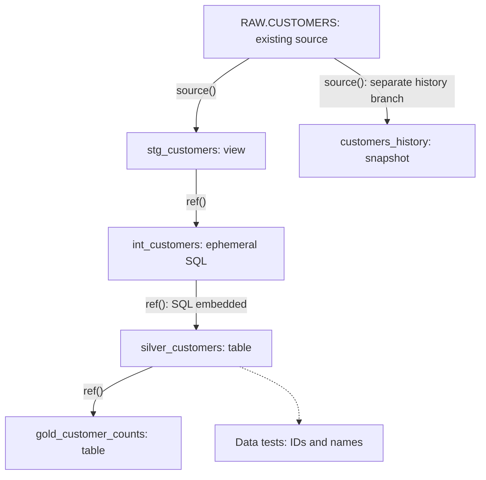

# Homework: Snowflake ELT + Introduction to dbt

## Objective

Today you built a small Snowflake ELT pipeline:

```text
PostgreSQL
     │
     │ Extract
     ▼
    CSV
     │
     │ PUT / COPY INTO
     ▼
Snowflake RAW
     │
     │ Dynamic Table
     ▼
Snowflake SILVER
     │
     │ Dynamic Table
     ▼
Snowflake GOLD
```

You also explored **Time Travel, RBAC, micro-partitions, pruning, clustering, warehouse sizing, and cost controls**.

For this homework, extend that pipeline and then prepare for Monday's introduction to **dbt (Data Build Tool)**.

The main question to keep in mind is:

> **Once data has arrived in the warehouse, how should we organize, test, document, and maintain all of our SQL transformations?**

That is where dbt becomes useful.

---

# Part 1 — Build a Snowflake RAW → SILVER Transformation

**Setup help:** [PostgreSQL SALES source and Snowflake RAW loading checkpoints](snowflake-homework-starter/README.md) supplies a 20-row fictional dataset matching the SALES schema, with deliberate quality issues. PostgreSQL source: `homework_db.source.sales`; local CSV: `data/raw/snowflake-homework/sales.csv`. Upload and load it into Snowflake RAW before starting the profiling below.

Use a dataset you loaded into Snowflake today. You can use `SALES`, `ORDERS`, or another similar table.

Assume:

```text
DE_CLASS.RAW
DE_CLASS.SILVER
DE_CLASS.GOLD
```

exist.

### Challenge 1 — Data profiling

Before transforming the data, investigate its quality.

Write SQL that determines:

- total number of records
- number of distinct IDs
- duplicate IDs
- records containing NULLs
- invalid negative quantities/prices
- minimum and maximum dates
- distinct countries/categories


Do **not** modify the RAW data.


```sql
SELECT 
    COUNT(*) AS total_records,
    COUNT(DISTINCT transaction_id) AS total_distinct_id,
    MIN(transaction_date) AS earliest_date,
    MAX(transaction_date) AS latest_date
FROM DE_CLASS.RAW.SALES;

SELECT *
FROM DE_CLASS.RAW.SALES
WHERE 
    transaction_id is Null 
    OR transaction_date is Null 
    OR customer_name is Null
    OR product is Null
    OR category is Null
    OR quantity is Null
    OR unit_price is Null
    OR country is Null;

SELECT transaction_id, quantity, unit_price
FROM DE_CLASS.RAW.SALES
WHERE 
    quantity < 0
    OR unit_price <= 0;

SELECT country, COUNT(*) AS record_count
FROM DE_CLASS.RAW.SALES
GROUP BY country;

SELECT transaction_id, COUNT(*) AS occurrences
FROM DE_CLASS.RAW.SALES
WHERE transaction_id IS NOT NULL
GROUP BY transaction_id
HAVING COUNT(*) > 1;
```


### Question

Why would we normally preserve bad data in RAW rather than fixing it there?
- So we can always go back to the original data if we need to investigate issues or reprocess it differently. It serves as a source of truth and allows for auditing and debugging.

---

# Part 2 — Build a Clean SILVER Dataset

Create a cleaned version of your data.

Your transformation should perform at least **five** of the following:

- remove invalid records
- remove duplicates
- standardize capitalization
- trim whitespace
- handle NULLs
- standardize country names
- standardize category names
- validate IDs
- calculate a new field
- cast fields into appropriate data types

1. **A dynamic table would keep your cleaned Silver result refreshed as RAW changes.** A regular `CREATE TABLE ... AS SELECT` stores the result once; a dynamic table retains the transformation definition and lets Snowflake refresh its stored result. You still need to load new records into RAW yourself.
2. **Your final creation statement would add a freshness target and refresh warehouse:**

   ```
   CREATE DYNAMIC TABLE DE_CLASS.SILVER.SALES
       TARGET_LAG = '10 MINUTES'
       WAREHOUSE = DE_WH
   AS
   -- Your cleaning query goes here.
   SELECT ...;
   ```
3. applied here:
CREATE DYNAMIC TABLE DE_CLASS.SILVER.SALES
    TARGET_LAG = '10 MINUTES'
    WAREHOUSE = DE_WH
AS
WITH stage1 AS (
    -- Your ID validation and deduplication query.
    SELECT ...
    FROM DE_CLASS.RAW.SALES
),
stage2 AS (
    -- Your trimming, capitalization, CASE, and amount calculation.
    SELECT ...
    FROM stage1
)
SELECT *
FROM stage2;
4. **You would clean through the defining SQL rather than successive `UPDATE` statements.** Dynamic tables don’t allow direct `INSERT`, `UPDATE`, or `DELETE` operations. For your homework, a regular table gives you a controlled batch result; a dynamic table demonstrates how the same cleaning rules can maintain a changing dataset.

```sql
CREATE TEMPORARY VIEW DE_CLASS.SILVER.SALES_STAGE1 AS
SELECT transaction_id
FROM DE_CLASS.RAW.SALES
WHERE transaction_id IS NOT NULL
  AND TRIM(transaction_id) <> ''
QUALIFY ROW_NUMBER() OVER (
    PARTITION BY transaction_id
    ORDER BY transaction_date DESC NULLS LAST
) = 1;

CREATE TEMPORARY VIEW DE_CLASS.SILVER.SALES_STAGE2 AS
SELECT
    TRANSACTION_ID,
    TRANSACTION_DATE,
    INITCAP(TRIM(CUSTOMER_NAME)) AS CUSTOMER_NAME,
    UPPER(TRIM(PRODUCT)) AS PRODUCT,
    UPPER(TRIM(CATEGORY)) AS CATEGORY,
    QUANTITY,
    UNIT_PRICE,
    QUANTITY * UNIT_PRICE AS TOTAL_AMOUNT,
    CASE
        -- Normalize the input before comparing it.
        WHEN UPPER(TRIM(country)) IN ('USA', 'UNITED STATES', 'US')
            THEN 'USA'
        WHEN UPPER(TRIM(country)) IN ('CANADA', 'CA')
            THEN 'CANADA'
    -- Preserve other labels after basic normalization.
    ELSE UPPER(TRIM(country))
    END AS country
FROM DE_CLASS.SILVER.SALES_STAGE1
WHERE QUANTITY > 0 AND UNIT_PRICE > 0;

CREATE TABLE DE_CLASS.SILVER.SALES AS
SELECT 
    CAST(TRANSACTION_ID AS STRING),
    CAST(TRANSACTION_DATE AS DATE),
    CAST(CUSTOMER_NAME AS STRING) AS CUSTOMER_NAME,
    CAST(PRODUCT AS STRING) AS PRODUCT,
    CAST(CATEGORY AS STRING) AS CATEGORY,
    CAST(QUANTITY AS INTEGER),
    CAST(UNIT_PRICE AS DECIMAL(10,2)),
    QUANTITY * UNIT_PRICE AS TOTAL_AMOUNT,
    CAST(COUNTRY AS STRING) AS COUNTRY
FROM DE_CLASS.SILVER.SALES_STAGE2;

```


Create the result as either a **regular table or Dynamic Table**.

### Questions

Explain:

1. Why is this transformation ELT rather than ETL?
    - because we loaded it into snowflake and then made the transformations.
2. Why should these transformations happen in SILVER rather than RAW?
    - because we want to keep RAW around as a history and audit
3. What advantage would a Dynamic Table provide here?
    - snowflake manages rerunning the pipeline as RAW data changes, so if we are getting micro batches, then we don't need to manually go in and handle each run
4. When might you prefer a regular table instead?
    - manual control is important, data is not changing regularly, or a specific batch is data we are looking at. like we want to see sales the day before christmas with specific transformations

---

# Part 3 — Build a GOLD Dataset

Create a business-level aggregation from your SILVER data.

For example:

```text
COUNTRY | CATEGORY    | TRANSACTIONS | UNITS | REVENUE
--------+-------------+--------------+-------+--------
USA     | ELECTRONICS | 15           | 27    | 8500
USA     | FURNITURE   | 8            | 12    | 4200
CANADA  | ELECTRONICS | 7            | 9     | 3100
```

Write the SQL yourself.

Your Gold table must include:

- at least one `GROUP BY`
- `COUNT`
- `SUM`
- at least one calculated business metric

```sql
CREATE TABLE DE_CLASS.GOLD.SALES AS
SELECT 
    country, 
    category, 
    COUNT(*) AS transactions, 
    SUM(quantity) AS units, 
    SUM(total_amount) AS revenue,
    SUM(total_amount) / COUNT(*) AS average_transaction_value
FROM DE_CLASS.SILVER.SALES
GROUP BY country, category
ORDER BY revenue DESC, country, category;

```


### Bonus

Create a second Gold dataset answering a different business question, such as:

```text
Revenue by day
Revenue by customer
Average transaction value by country
Top-selling products
Units sold by category
```

---

# Part 4 — Time Travel Recovery Challenge

Create a disposable table:

```sql
CREATE TABLE DE_CLASS.RAW.RECOVERY_TEST AS
SELECT *
FROM DE_CLASS.RAW.SALES;
```

Check its count.

Then intentionally damage it:

```sql
DELETE FROM DE_CLASS.RAW.RECOVERY_TEST
WHERE COUNTRY = 'USA';
```

Your job is to recover the deleted records using Snowflake Time Travel.

Use **one** of:

```text
AT (TIMESTAMP => ...)
AT (OFFSET => ...)
BEFORE (STATEMENT => ...)
```

Verify that the recovered table matches its original record count.

```sql
CREATE TABLE DE_CLASS.RAW.RECOVERED AS
SELECT * 
FROM DE_CLASS.RAW.RECOVERY_TEST
AT (OFFSET => -6000)

SELECT
    (SELECT COUNT(*) FROM DE_CLASS.RAW.RECOVERED) AS recovered_records,
    (SELECT COUNT(*) FROM DE_CLASS.RAW.SALES) AS original_records;
```

**Using the DELETE statement’s query ID is more precise.** Find that ID in Query History, then use:
```sql
CREATE TABLE DE_CLASS.RAW.RECOVERED AS
SELECT *
FROM DE_CLASS.RAW.RECOVERY_TEST
BEFORE (STATEMENT => '<delete_query_id>');
```

### Bonus challenge

Create a historical zero-copy clone:

```sql
CREATE TABLE ...
CLONE ...
AT (...);
```

Explain why cloning a historical version could be safer than immediately overwriting the damaged production table.

---

# Part 5 — RBAC Challenge

Assume a company has three groups:

```text
DATA_ENGINEER
DATA_ANALYST
FINANCE_ANALYST
```

The requirements are:

```text
DATA_ENGINEER
→ RAW, SILVER and GOLD

DATA_ANALYST
→ read SILVER and GOLD

FINANCE_ANALYST
→ read GOLD only
```

Write the Snowflake SQL required to create these roles and grant the appropriate privileges.

You will need to investigate commands such as:

```sql
CREATE ROLE
GRANT USAGE
GRANT SELECT
GRANT ROLE
```

Remember that accessing a table usually requires privileges at multiple levels:

```text
WAREHOUSE
    +
DATABASE
    +
SCHEMA
    +
TABLE
```


GRANT <privilege> ON <object_type> <object_name> TO ROLE <role_name>;
**`USAGE` doesn’t grant permission to read table rows—`SELECT` does**
and permission only applies to current tables unless you use:
```sql
GRANT SELECT, INSERT, UPDATE
    ON FUTURE TABLES IN SCHEMA DE_CLASS.SILVER
    TO ROLE DATA_ENGINEER;
```
| Privilege | Action |
|---|---|
| `CREATE TABLE` on schema | Create new tables |
| `SELECT` on table | Read rows |
| `INSERT` on table | Add rows |
| `UPDATE` on table | Change rows |
| `DELETE` on table | Remove rows |

**Omitting `DELETE` doesn’t guarantee the role cannot delete.** It might obtain that privilege through another role, and tables it creates are normally owned by it

```sql
CREATE ROLE DATA_ENGINEER;
CREATE ROLE DATA_ANALYST;
CREATE ROLE FINANCE_ANALYST;

GRANT USAGE ON WAREHOUSE DE_WH TO ROLE FINANCE_ANALYST;
GRANT USAGE ON DATABASE DE_CLASS TO ROLE FINANCE_ANALYST;
GRANT USAGE ON SCHEMA DE_CLASS.GOLD TO ROLE FINANCE_ANALYST;
GRANT SELECT ON ALL TABLES IN SCHEMA DE_CLASS.GOLD
    TO ROLE FINANCE_ANALYST;

GRANT USAGE ON WAREHOUSE DE_WH TO ROLE DATA_ANALYST;
GRANT USAGE ON DATABASE DE_CLASS TO ROLE DATA_ANALYST;
GRANT USAGE ON SCHEMA DE_CLASS.GOLD TO ROLE DATA_ANALYST;
GRANT USAGE ON SCHEMA DE_CLASS.SILVER TO ROLE DATA_ANALYST;
GRANT SELECT ON ALL TABLES IN SCHEMA DE_CLASS.GOLD
    TO ROLE DATA_ANALYST;
GRANT SELECT ON ALL TABLES IN SCHEMA DE_CLASS.SILVER
    TO ROLE DATA_ANALYST;

GRANT USAGE ON WAREHOUSE DE_WH TO ROLE DATA_ENGINEER;
GRANT USAGE ON DATABASE DE_CLASS TO ROLE DATA_ENGINEER;
GRANT USAGE ON SCHEMA DE_CLASS.GOLD TO ROLE DATA_ENGINEER;
GRANT USAGE ON SCHEMA DE_CLASS.SILVER TO ROLE DATA_ENGINEER;
GRANT SELECT, INSERT, UPDATE ON ALL TABLES IN SCHEMA DE_CLASS.GOLD
    TO ROLE DATA_ENGINEER;
GRANT SELECT, INSERT, UPDATE ON ALL TABLES IN SCHEMA DE_CLASS.SILVER
    TO ROLE DATA_ENGINEER;
GRANT SELECT, INSERT, UPDATE ON ALL TABLES IN SCHEMA DE_CLASS.RAW
    TO ROLE DATA_ENGINEER;

GRANT ROLE FINANCE_ANALYST TO USER <finance_username>;
```

### Question

Why is this preferable to individually granting permissions to every user?
- It simplifies management by grouping users into roles, allowing for easier assignment and revocation of permissions. It also enhances security by ensuring consistent access control policies across users with similar responsibilities.

---

# Part 6 — Performance Investigation

Suppose this query becomes slow when `SALES` grows to **5 billion rows**:

```sql
SELECT
    COUNTRY,
    SUM(QUANTITY * UNIT_PRICE)
FROM DE_CLASS.RAW.SALES
WHERE TRANSACTION_DATE
    BETWEEN '2026-01-01' AND '2026-01-31'
GROUP BY COUNTRY;
```

Answer the following:

1. What is a Snowflake **micro-partition**?
    - A micro-partition is a small, contiguous unit of storage in Snowflake that contains a subset of table data. Each micro-partition is automatically created and managed by Snowflake, allowing for efficient data organization, compression, and retrieval. They enable features like partition pruning and improve query performance by allowing the system to skip irrelevant partitions during query execution.
2. What is **partition pruning**?
    - Partition pruning is a performance optimization technique where the query engine skips scanning certain micro-partitions that do not contain relevant data for the query being executed. By using metadata about the data distribution within micro-partitions, Snowflake can avoid reading unnecessary data, which reduces I/O and speeds up query execution.
3. Why can pruning make this query faster?
    - Pruning can make this query faster because it allows Snowflake to only read the micro-partitions that contain data for the specified `TRANSACTION_DATE` range. This reduces the amount of data that needs to be scanned and processed, leading to quicker query execution times. Snowflake scans partitions that **might contain matching dates**. A scanned partition can also contain dates outside January; row filtering removes those afterward.
4. Why wouldn't you immediately increase the warehouse size?
    - I would inspect Query Profile first to see whether the problem is excessive scanning, expensive operations, spilling, or queueing. A larger warehouse might help, but it could increase costs without fixing poor pruning or inefficient SQL.
5. When might `TRANSACTION_DATE` be a useful clustering key?
    - `TRANSACTION_DATE` could be a useful clustering key if queries frequently filter or aggregate data based on date ranges. Clustering the data by `TRANSACTION_DATE` can improve query performance by ensuring that related records are stored together, which enhances partition pruning and reduces the amount of data scanned during queries that involve date-based filtering. Grouping by date alone doesn’t necessarily let Snowflake skip data
6. Why shouldn't every table have a clustering key?
    - A clustering key is one or more columns or expressions Snowflake uses to improve how related values are grouped across micro-partitions. 
    - Not every table needs one because small tables or naturally well-clustered tables may already perform well. Maintaining clustering consumes compute credits and can add storage costs, so the measured query benefit should justify that expense.

### Code challenge

Research what this command tells you:

```sql
SELECT SYSTEM$CLUSTERING_INFORMATION(
    'DE_CLASS.RAW.SALES',
    '(TRANSACTION_DATE)'
);
```

Write 2–3 sentences explaining the output.

- This command returns JSON describing how `SALES` is clustered with respect to `TRANSACTION_DATE`, including micro-partition counts, average overlap, average depth, and a depth histogram. Lower overlap and depth generally indicate better separation of date ranges, which can help Snowflake prune partitions during date-filtered queries. It diagnoses the existing layout; it does not create a clustering key or guarantee faster queries.

---

# Part 7 — Cost Challenge

Examine your warehouse:

```sql
SHOW WAREHOUSES;
```

Configure your class warehouse appropriately for a development environment.

For example:

```sql
ALTER WAREHOUSE DE_WH
SET
    WAREHOUSE_SIZE = 'XSMALL'
    AUTO_SUSPEND = 60
    AUTO_RESUME = TRUE;
```

Then answer:

> Why could an X-Small warehouse sometimes cost **more** to complete a workload than a larger warehouse?

Think about both:

```text
credit consumption rate
        ×
execution time
```

- **An X-Small warehouse costs less per hour, but it may run longer.** The total compute cost depends on the credit rate multiplied by the time the warehouse runs.
| Warehouse | Credit rate | Runtime | Total credits |
|---|---:|---:|---:|
| X-Small | 1 credit/hour | 30 minutes | 0\.50 |
| Small | 2 credits/hour | 10 minutes | 0\.33 |

- Here, Small finishes three times faster while charging twice the hourly rate, so the workload costs less. A larger warehouse will **not always** provide enough improvement to save money; measure the actual workload. Snowflake bills compute per second, with a 60-second minimum each time a warehouse starts.

Also explain the difference between:

```text
Scale UP
X-Small → Small → Medium

vs.

Scale OUT
Cluster 1
Cluster 2
Cluster 3
```

| Approach | What changes? | Intended problem |
|---|---|---|
| **Scale up** | Increase the size of each warehouse cluster: X-Small → Small → Medium | Queries need more compute or memory—for example, expensive joins or aggregations |
| **Scale out** | Add warehouse clusters of the same size | Many queries run concurrently and wait in a queue |
- Adding clusters lets Snowflake distribute concurrent queries across them; the clusters do not pool their resources to accelerate one query. Multi-cluster warehouses require Enterprise Edition or higher.

What performance problem is each intended to solve?
- **Your development settings are a reasonable starting point:** `XSMALL` provides a small initial compute allocation, `AUTO_SUSPEND = 60` suspends the warehouse after 60 seconds of inactivity, and `AUTO_RESUME = TRUE` starts it when work requires it. Frequent suspend/resume cycles can still incur repeated 60-second minimum charges, so adjust the timeout if your usage pattern warrants it.

---

# Part 8 — Prepare for Monday: What Is dbt?

Read about **dbt (Data Build Tool)** before Monday.

You don't need to become proficient with it yet.

Understand this central idea:

> dbt allows data engineers and analytics engineers to define warehouse transformations primarily as SQL `SELECT` statements while dbt handles dependencies, materialization, testing, documentation, and execution.

Today we manually created something like:

```text
RAW.SALES
    │
    │ SQL
    ▼
SILVER.SALES
    │
    │ SQL
    ▼
GOLD.SALES_BY_COUNTRY
```

In dbt, these transformations become **models**.

For example:

```sql
-- models/silver/sales.sql

SELECT
    transaction_id,
    transaction_date,
    INITCAP(TRIM(customer_name)) AS customer_name,
    UPPER(TRIM(category)) AS category,
    quantity,
    unit_price,
    quantity * unit_price AS total_amount,
    UPPER(TRIM(country)) AS country
FROM {{ source('raw', 'sales') }}
WHERE quantity > 0
```

Notice something important:

There is no:

```sql
CREATE TABLE ...
```

dbt decides how the model should be created based on its **materialization**.

---

# Part 9 — dbt Concepts to Research

Come to Monday's class able to explain, at a basic level, these terms:

| Concept | Basic meaning | Explanation / example |
| --- | --- | --- |
| **Model** | Transformation managed by dbt | In this lesson, a `.sql` file containing a `SELECT`, such as `sales.sql`, describes the cleaned dataset. dbt handles building it in the warehouse according to its configuration. |
| **Source** | Declared upstream data used by dbt | An existing loaded table such as `DE_CLASS.RAW.SALES`, described in YAML. Declaring it tells dbt where to find it; it does not extract the data from PostgreSQL or load the table. |
| **`ref()`** | Reference another dbt model | `{{ ref('sales') }}` resolves the model's configured database object and records a dependency. It can also reference seeds and snapshots. |
| **`source()`** | Reference a declared source | `{{ source('raw', 'sales') }}` resolves the table declared under source `raw`, table `sales`, and connects it to the model's lineage. These are declared logical names, not necessarily the physical schema/table names. |
| **Materialization** | How dbt implements a model | Determines whether the result becomes a view, table, incremental table, or SQL embedded in another model. It controls persistence and build behavior. |
| **View** | Model created as a database view | Stores the query definition. Querying the view evaluates its SQL against the underlying data rather than reading a separately stored model result. |
| **Table** | Model physically created as a table | Stores the query's result as rows. A normal dbt run rebuilds a table model; the stored result does not automatically update when its source changes. |
| **Incremental** | Update a subset instead of rebuilding everything | After the initial build, process records selected by the model's incremental logic. Updates, late arrivals, duplicates, and deletes need deliberate handling; dbt does not automatically know which records matter. |
| **Test** | Automated assertion about data | For example, check that an ID is unique/non-NULL, that a category is allowed, or that a foreign key exists. Data tests identify violations; they do not repair the records. |
| **Seed** | CSV data loaded and managed by dbt | Usually a small, version-controlled reference dataset, such as country-code mappings, loaded with `dbt seed`. It is not the normal ingestion method for a large sales feed. |
| **Snapshot** | Track changes to mutable records over time | Repeated snapshot runs preserve versions of records, such as a customer's changing address. Changes are observed when snapshots run; this is different from Snowflake Time Travel. |
| **Jinja** | Templating used inside dbt SQL | Expressions such as `{{ ref('sales') }}` and reusable macros are resolved into SQL before execution. Snowflake executes the resulting SQL, not the Jinja expression itself. |
| **DAG** | Directed acyclic graph of dependencies | A directed graph with no dependency cycles. `RAW source → Silver model → Gold model` shows which datasets depend on which others. |

References: [SQL models](https://docs.getdbt.com/docs/build/sql-models), [sources](https://docs.getdbt.com/docs/build/sources), [`ref()`](https://docs.getdbt.com/reference/dbt-jinja-functions/ref), [data tests](https://docs.getdbt.com/docs/build/data-tests), [seeds](https://docs.getdbt.com/docs/build/seeds), [snapshots](https://docs.getdbt.com/docs/build/snapshots), and [Jinja/macros](https://docs.getdbt.com/docs/build/jinja-macros).

Pay particular attention to these four materializations:

```text
view
table
incremental
ephemeral
```

### Comparing the four materializations

| Materialization | What exists in the database? | What happens when dbt builds it? | Useful when... |
| --- | --- | --- | --- |
| **`view`** | A view containing a query definition | dbt creates/replaces the view; its SQL is evaluated when queried | The transformation is simple and storing another result is unnecessary |
| **`table`** | A table containing result rows | dbt rebuilds the stored result from the model query | Many consumers reuse an expensive result and scheduled freshness is sufficient |
| **`incremental`** | A table containing accumulated results | First build processes the initial dataset; subsequent builds apply the configured subset/update strategy | A large dataset changes in a manageable way and the update rules are reliable |
| **`ephemeral`** | No standalone table or view for that model | dbt embeds its SQL as a common table expression (CTE) in dependent models | A small intermediate transformation improves code organization without needing its own database object |

- **Key distinction:** a model is the transformation definition; its materialization determines how that definition is implemented.
- **Ephemeral** is reusable SQL, not a temporary table. Its result is not independently queryable as a persisted object.
- **Incremental** is an optimization, not a correctness guarantee. For example, selecting only dates newer than the previous maximum can miss a late-arriving older sale. Define the selection and matching/update rules before relying on it.

References: [materializations](https://docs.getdbt.com/docs/build/materializations) and [incremental models](https://docs.getdbt.com/docs/build/incremental-models).

---

# Part 10 — Think Like dbt

You currently have:

```text
RAW.SALES
     ↓
SILVER.SALES
     ↓
GOLD.SALES_BY_COUNTRY
```

Imagine these become:

```text
models/
│
├── silver/
│   └── sales.sql
│
└── gold/
    └── sales_by_country.sql
```

Instead of the Gold model directly referencing a database object:

```sql
FROM DE_CLASS.SILVER.SALES
```

dbt might contain:

```sql
FROM {{ ref('sales') }}
```

That seemingly small change is extremely important.

## Annotated dbt example: connect the terms to code

This is a small teaching example, not another required deliverable. It assumes an illustrative Snowflake table `DE_CLASS.RAW.CUSTOMERS` with `CUSTOMER_ID`, `CUSTOMER_NAME`, `COUNTRY_CODE`, and `UPDATED_AT`. That table and those columns are assumptions for this example, not additions to your sales dataset. The source has one current row per customer; `UPDATED_AT` is a non-NULL timestamp that advances whenever the customer changes.

The snippets below are file contents you could place in a separate configured dbt project. They were not executed. A working Snowflake adapter, connection profile, warehouse, privileges, and source data would still be required.

### A. File organization: which file owns what?

```text
customer_demo/                         # Author-chosen project folder
├── dbt_project.yml                    # Project settings and profile selection
├── models/
│   ├── sources.yml                    # SOURCE declarations for existing tables
│   ├── properties.yml                 # Descriptions and generic DATA TESTS
│   ├── staging/
│   │   └── stg_customers.sql           # MODEL materialized as a VIEW
│   ├── intermediate/
│   │   └── int_customers.sql           # EPHEMERAL model; no standalone relation
│   ├── silver/
│   │   └── silver_customers.sql        # MODEL materialized as a TABLE
│   └── gold/
│       └── gold_customer_counts.sql    # MODEL that depends on Silver via ref()
├── tests/
│   └── assert_customer_names.sql       # Singular DATA TEST returning bad rows
├── seeds/
│   └── country_codes.csv              # Small reference-data SEED
└── snapshots/
    └── customers_history.yml          # SNAPSHOT definition, dbt 1.9+ syntax

~/.dbt/profiles.yml                    # Separate connection settings; outside project
```

`stg_`, `int_`, `silver_`, and `gold_` are naming conventions we chose. `ref()`, `source()`, `config()`, and the materialization values are dbt features. Folder names organize files; they do not automatically create `STAGING`, `SILVER`, or `GOLD` database schemas. With this minimal configuration, model relations use the target database/schema from the profile. Custom schema configuration has its own rules. See [dbt schema configuration](https://docs.getdbt.com/reference/resource-configs/schema).

### B. Project configuration and source declaration

File: `dbt_project.yml`

```yaml
name: customer_demo          # Author-chosen project name
version: '1.0.0'             # Our project version, not the installed dbt version
config-version: 2           # dbt project configuration format
profile: customer_demo      # Must match a profile in ~/.dbt/profiles.yml
model-paths: [models]
test-paths: [tests]
seed-paths: [seeds]
snapshot-paths: [snapshots]
```

File: `models/sources.yml`

```yaml
version: 2                  # YAML properties-file format
sources:
  - name: raw               # Logical SOURCE name used in source('raw', ...)
    database: DE_CLASS      # Physical Snowflake database
    schema: RAW             # Physical schema holding the already loaded data
    tables:
      - name: customers     # Logical table name used in source(..., 'customers')
        identifier: CUSTOMERS  # Physical table name
        description: One current record per customer, loaded before dbt runs.
```

The YAML describes where the source already exists. It does not run `CREATE TABLE` or `COPY INTO`. See [declaring sources](https://docs.getdbt.com/docs/build/sources).

### C. Models, Jinja, and three materializations

File: `models/staging/stg_customers.sql`

```sql
-- JINJA: dbt evaluates template expressions before sending SQL to Snowflake.
-- MATERIALIZATION: create a VIEW, storing this query's definition.
{{ config(materialized='view') }}

-- MODEL: this SELECT defines a reusable dataset.
select
    customer_id,
    customer_name,
    country_code,
    updated_at
-- SOURCE(): resolves DE_CLASS.RAW.CUSTOMERS and declares source lineage.
from {{ source('raw', 'customers') }}
```

File: `models/intermediate/int_customers.sql`

```sql
-- EPHEMERAL: dbt embeds this SQL in dependent queries as a CTE.
-- There will be no standalone int_customers table or view to query.
{{ config(materialized='ephemeral') }}

select
    customer_id,
    trim(customer_name) as customer_name,
    upper(trim(country_code)) as country_code,
    updated_at
-- REF(): references the model name, not a hard-coded schema/table.
from {{ ref('stg_customers') }}
```

File: `models/silver/silver_customers.sql`

```sql
-- TABLE: persist the SELECT result; a normal run rebuilds this model.
{{ config(materialized='table') }}

select
    customer_id,
    customer_name,
    country_code,
    updated_at
-- REF() to an ephemeral model causes its SQL to be embedded here.
from {{ ref('int_customers') }}
```

File: `models/gold/gold_customer_counts.sql`

```sql
{{ config(materialized='table') }}

-- GOLD GRAIN: one row per country code, not one row per customer.
select
    country_code,
    count(*) as customer_count
-- DEPENDENCY: dbt learns that this model needs silver_customers first.
from {{ ref('silver_customers') }}
group by country_code
```

The core names come from the `.sql` filenames. dbt converts the Jinja references into the configured database relations, or embeds SQL for an ephemeral model. We intentionally leave duplicates and missing values for tests to expose; trimming a name is not a complete quality policy. See [SQL models](https://docs.getdbt.com/docs/build/sql-models), [Jinja](https://docs.getdbt.com/docs/build/jinja-macros), and [materializations](https://docs.getdbt.com/docs/build/materializations).

### D. DAG: how dbt knows the order



Solid arrows show data dependencies. The dotted arrow marks quality checks. dbt builds selected resources in dependency order; the ephemeral node contributes SQL rather than getting its own stored object. The snapshot is a separate branch, and Gold does not consume it. Defining tests does not make them run every time someone queries the table: a test/build job must execute them. See [`ref()` and dependency ordering](https://docs.getdbt.com/reference/dbt-jinja-functions/ref).

### E. Tests: express what valid data means

File: `models/properties.yml`

```yaml
version: 2
models:
  - name: silver_customers   # Connect these properties to the MODEL name
    description: One cleaned current record per customer.
    columns:
      - name: customer_id
        description: Unique identifier for a customer.
        data_tests:
          - not_null        # TEST: no customer may have a missing ID
          - unique          # TEST: customer IDs must not repeat
      - name: customer_name
        data_tests:
          - not_null        # Does not reject an empty string; see custom test
```

File: `tests/assert_customer_names.sql`

```sql
-- SINGULAR DATA TEST: return records that violate the rule.
-- Zero rows means the assertion passes; bad rows make it fail by default.
select customer_id
from {{ ref('silver_customers') }}
where customer_name is null
   or trim(customer_name) = ''
```

If two records share an ID, `unique` flags the problem; it does not choose a winner or delete a duplicate. Descriptions document the contract; tests check specific parts of it. See [dbt data tests](https://docs.getdbt.com/docs/build/data-tests).

### F. Seed: a small CSV owned by the project

File: `seeds/country_codes.csv`

```csv
country_code,country_name
US,United States
CA,Canada
```

CSV has no standard comment syntax, so the explanation stays outside the file. This is reference data, not the RAW customer feed. dbt loads it as a seed table. A model could read it with:

```sql
-- REF() can reference a SEED as well as a model.
select country_code, country_name
from {{ ref('country_codes') }}
```

This standalone query illustrates the reference; it is not another required file in the tree. The main customer DAG does not use the seed yet. A future model could join it to customers for display names. See [dbt seeds](https://docs.getdbt.com/docs/build/seeds).

### G. Snapshot: preserve observed customer changes

File: `snapshots/customers_history.yml` — uses YAML snapshot syntax available in dbt 1.9 and later.

```yaml
snapshots:
  - name: customers_history
    relation: source('raw', 'customers')  # Source whose changes we observe
    config:
      schema: history                   # Custom schema; naming rules still apply
      unique_key: customer_id           # Same customer across multiple versions
      strategy: timestamp               # Detect changes using update timestamps
      updated_at: updated_at            # Must reliably advance on every change
```

If a customer's country changes and `UPDATED_AT` advances, a later snapshot run closes the old version and records the new one. dbt adds validity metadata such as `dbt_valid_from` and `dbt_valid_to`. It only observes states available when it runs; it cannot reconstruct every change between runs. This example does not configure source-deletion tracking. See [dbt snapshots](https://docs.getdbt.com/docs/build/snapshots).

### H. Incremental: an alternative Silver implementation

This is an **alternative** to section C's `silver_customers.sql`, not an additional model with the same name. It assumes a reliable timestamp and one source row per customer. Snowflake's `merge` strategy can match existing customers by ID and update them.

```sql
-- INCREMENTAL MATERIALIZATION: retain the table between ordinary runs.
{{ config(
    materialized='incremental',
    unique_key='customer_id',
    incremental_strategy='merge'
) }}

select customer_id, customer_name, country_code, updated_at
from {{ ref('int_customers') }}

-- JINJA CONTROL FLOW: include this WHERE only for an incremental run.
-- First build / full refresh reads the complete input instead.

where updated_at >= (
    -- THIS: dbt's reference to the current model's destination table.
    -- >= reconsiders records tied at the last processed timestamp.
    select coalesce(max(updated_at), '1900-01-01'::timestamp)
    from {{ this }}
)

```

`unique_key` tells the merge how to match rows; it is not a uniqueness test or enforced constraint. This simple watermark can still miss records arriving with older timestamps and does not propagate source deletions. A real implementation needs a late-data/replay policy and tests. See [incremental models](https://docs.getdbt.com/docs/build/incremental-models).

### I. Commands: connect project definitions to execution

Run from the configured project folder. These are illustrative commands, not instructions to install or build another project for Monday.

```bash
# Verify profile/connection settings; does not load RAW data.
dbt debug

# Build the Gold model and its ancestors; + means include upstream nodes.
# dbt build also runs applicable data tests for the selected resources.
dbt build --select +gold_customer_counts

# Load the SEED independently; the main customer branch does not reference it.
dbt seed --select country_codes

# Observe the current source state and update the SNAPSHOT history branch.
dbt snapshot --select customers_history

# Generate project documentation/catalog; does not rebuild model data.
dbt docs generate
```

For section C's model definitions, expect a staging view, two result tables, and no standalone `int_customers` object. Gold contains customer counts by country. With the source contract satisfied, the ID/name tests pass; missing names or duplicate IDs provide a useful failure case. These are expected outcomes, not results from an executed build. See [`dbt build`](https://docs.getdbt.com/reference/commands/build).

Airflow could coordinate “load RAW → run the selected dbt build → notify a downstream system.” A supported Snowflake `dynamic_table` materialization could replace a table implementation when managed refresh is appropriate; configuring a regular `table` as above does not enable background refresh. See [Airflow](https://airflow.apache.org/docs/apache-airflow/stable/index.html) and [dynamic tables in dbt](https://docs.snowflake.com/en/user-guide/dynamic-tables/dbt).

### Final questions

Come prepared to discuss:

1. What information does dbt gain by using `ref()` instead of hard-coded table names?

   - dbt learns that the current model depends on a specific project resource. It can use that relationship for execution order, lineage, and selecting related models.
   - It also resolves the correct database/schema/object name from configuration, which helps separate development and production. A hard-coded table name tells the database where to read, but does not declare that dbt dependency. See [`ref()`](https://docs.getdbt.com/reference/dbt-jinja-functions/ref).

2. How could dbt determine that the Silver model must run before the Gold model?

   - Gold's `{{ ref('sales') }}` declares its dependency on the Silver model named `sales`. dbt parses the reference and adds the edge `sales → sales_by_country` to its DAG.
   - When both are selected, dbt builds Silver before Gold. Folder names alone do not establish this order. Selecting only Gold does not automatically rebuild every parent; `dbt build --select +sales_by_country` includes its ancestors. See [`ref()` dependency ordering](https://docs.getdbt.com/reference/dbt-jinja-functions/ref) and [build selection](https://docs.getdbt.com/reference/commands/build).

3. What happens if we eventually have 100 transformations instead of two?

   - Maintaining the order and relationships manually becomes harder. Models and declared references let dbt track the dependency graph, while shared intermediate models reduce repeated SQL.
   - We can organize models by purpose, document their grain and ownership, and select the relevant part of the graph for a build. Independent branches can run concurrently within configured limits. We still need clear names, tests, review, and cost controls; a bigger graph does not automatically become efficient. See [SQL model organization and execution](https://docs.getdbt.com/docs/build/sql-models).

4. What benefits would automated tests provide?

   - Repeatable checks catch missing IDs, duplicates, broken relationships, and invalid business values after changes or new loads. For example, a `unique` test can expose a Silver deduplication problem before we trust Gold totals.
   - Tests make expectations explicit and reduce reliance on manually inspecting a few rows. `dbt build` runs selected resources and applicable tests in dependency order; an upstream error-severity test failure can skip dependent builds. Tests do not fix records, roll back every completed model, or prove rules we never tested. See [data tests](https://docs.getdbt.com/docs/build/data-tests) and [`dbt build`](https://docs.getdbt.com/reference/commands/build).

5. How is dbt different from an orchestration system such as Airflow?

   - dbt focuses on transformation projects: models, warehouse SQL, dependencies, materializations, tests, and documentation. It handles execution order within that transformation graph.
   - Airflow coordinates broader workflows: scheduling, waiting for inputs, retries, and tasks across different systems. For example, Airflow could schedule an export/load job, wait for success, invoke `dbt build`, and then trigger a downstream report.
   - They can work together. The distinction is responsibility and scope; the hosted dbt platform also provides job scheduling. See [dbt SQL models](https://docs.getdbt.com/docs/build/sql-models), [dbt job scheduling](https://docs.getdbt.com/docs/deploy/job-scheduler), and [Airflow's workflow role](https://airflow.apache.org/docs/apache-airflow/stable/index.html).

6. How might dbt complement Snowflake Dynamic Tables rather than necessarily replace them?

   - Snowflake Dynamic Tables provide stored query results with managed refresh capabilities. dbt provides a versioned project around transformation definitions, references, testing, and documentation.
   - With a supported `dbt-snowflake` adapter, a dbt model can use the `dynamic_table` materialization. dbt manages the definition, while configured Snowflake scheduling can refresh the result toward a target lag. Supported configurations can also put refresh timing under dbt control.
   - We should choose who owns refresh timing and verify freshness before trusting tests or downstream reports. Combining the tools does not make ingestion or quality checks automatic. See [dynamic tables in dbt](https://docs.snowflake.com/en/user-guide/dynamic-tables/dbt).

These are discussion notes based on official documentation reviewed on 2026-10-04. The conceptual snippets and dbt command above are illustrative; no dbt/Snowflake build was run for this homework edit.

## Deliverable

The code should demonstrate at minimum:

```text
✓ RAW data profiling
✓ SILVER transformation
✓ GOLD aggregation
✓ Time Travel recovery
✓ RBAC configuration
✓ Warehouse configuration
```

For Monday, you **do not need to build a dbt project yet**. The goal is to understand enough about **models, sources, `ref()`, materializations, tests and DAGs** that we can turn this weekend's RAW → SILVER → GOLD SQL into an actual dbt project during class.
